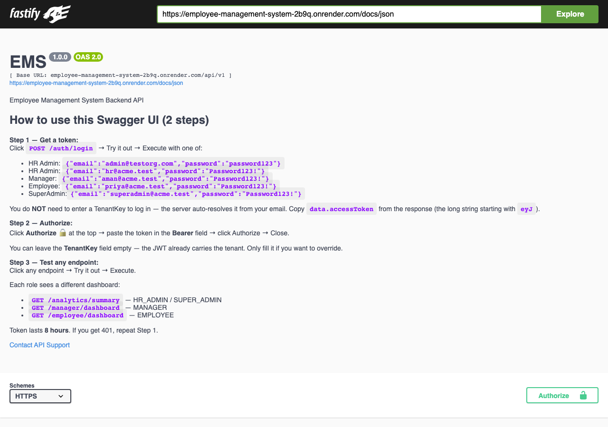
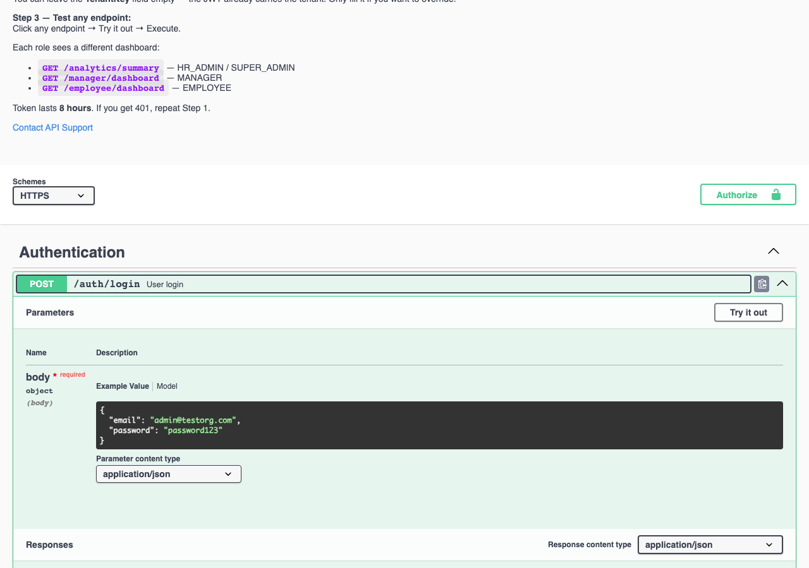
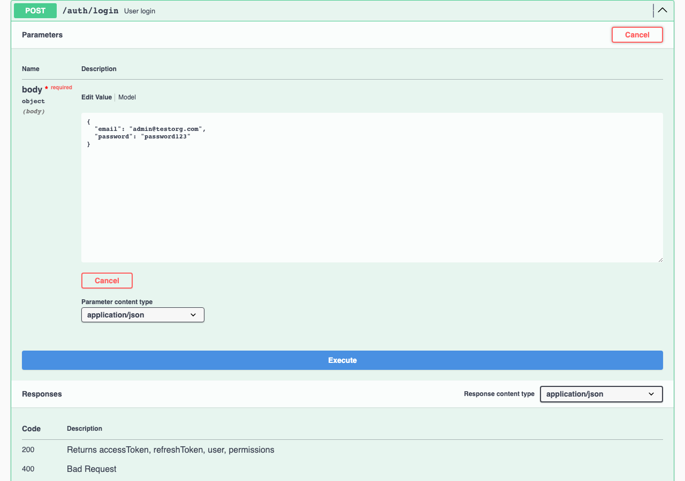
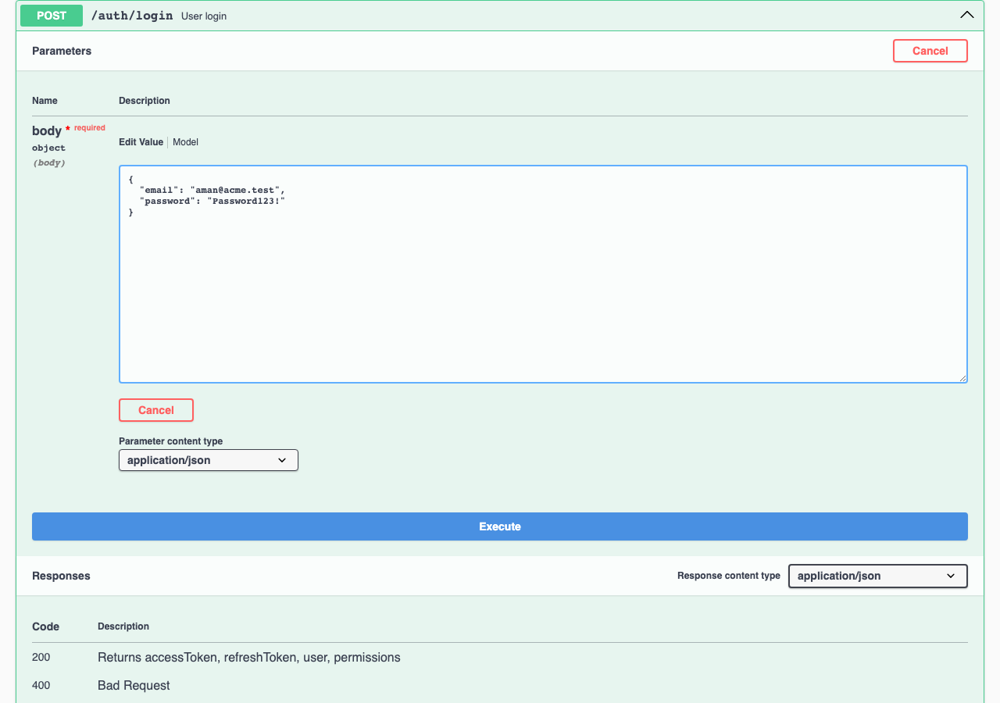
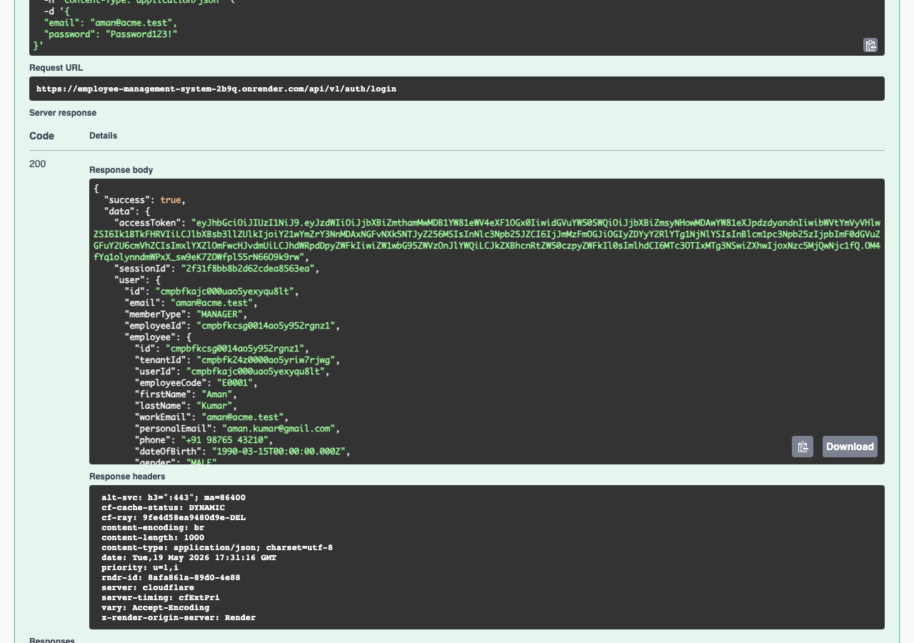
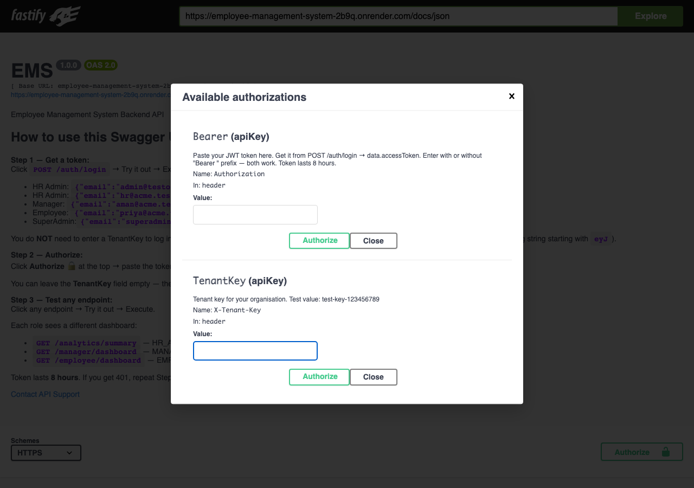
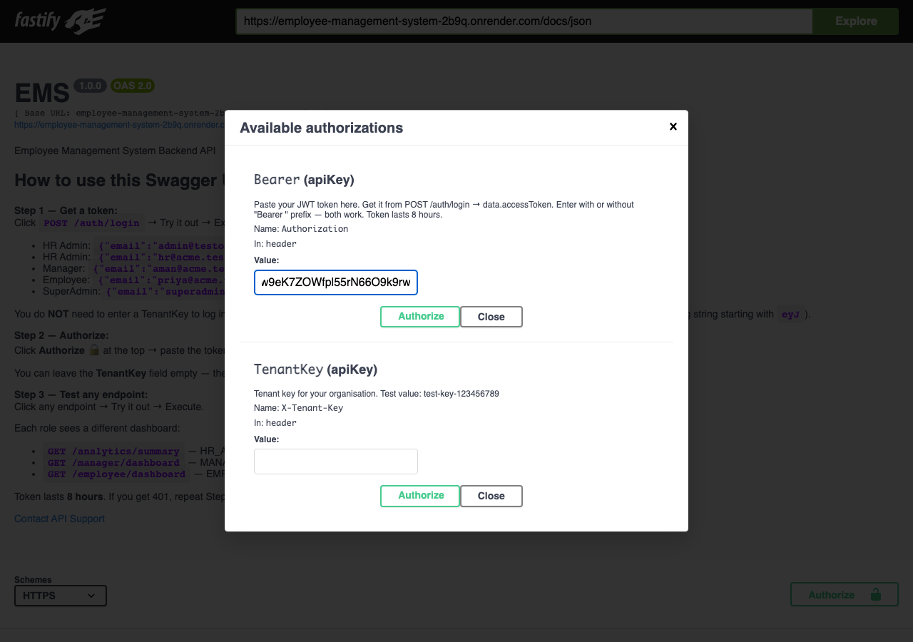
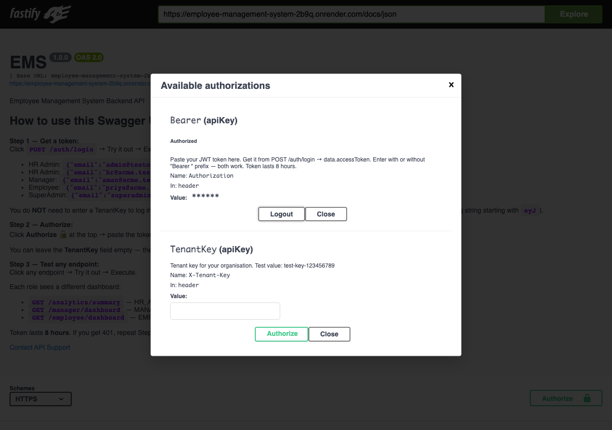
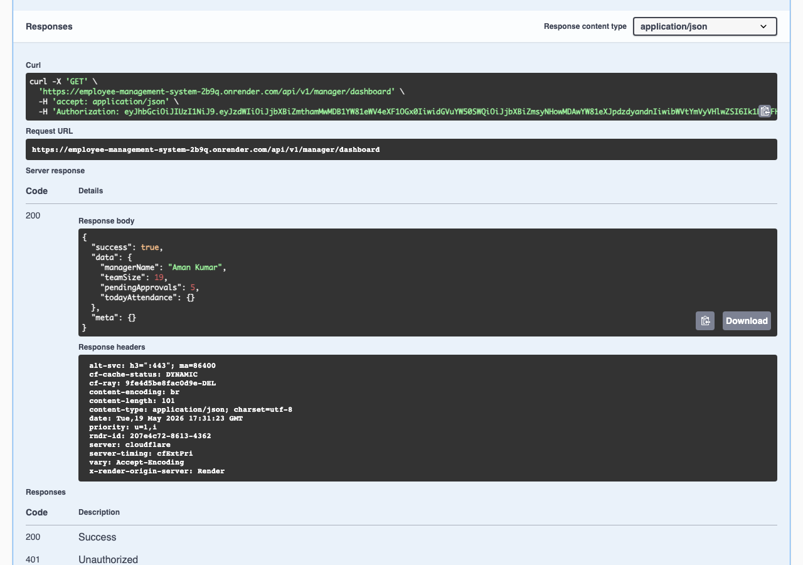

# EMS Swagger Testing Guide

**For the UI Team.** This is the complete, step-by-step guide for testing every EMS API through Swagger. Read it once, follow the screenshots, and you'll be testing in under 2 minutes.

- **Swagger URL:** https://employee-management-system-2b9q.onrender.com/docs/static/index.html
- **API Base URL:** https://employee-management-system-2b9q.onrender.com/api/v1
- **Postman Collection:** [EMS.postman_collection.json](./EMS.postman_collection.json) — Import it into Postman, run one of the Login requests, and every other request auto-uses the token.

## Test result (production, verified 2026-05-19)

| Metric                                | Count |
| ------------------------------------- | ----- |
| Total tests (39 endpoints × 5 users)  | **195** |
| ✅ Passed                              | **147** |
| ⚠️  Expected denials (400/401/403)     | **48**  |
| ❌ True failures                       | **0**   |

**Every endpoint that should work, works. Every denial is intentional.**

---

## Part A — The 2-Step Auth Flow (NEW, simpler)

You no longer need to enter `X-Tenant-Key`. The server auto-resolves the tenant from your email.

### Step 1 — Open Swagger UI

Open: https://employee-management-system-2b9q.onrender.com/docs/static/index.html



### Step 2 — Find `POST /auth/login` and click it to expand



### Step 3 — Click "Try it out"



### Step 4 — Paste credentials in the body

Use **one** of these depending on which role you want to test:

```json
{ "email": "superadmin@acme.test", "password": "Password123!" }   // SUPER_ADMIN
{ "email": "hr@acme.test",         "password": "Password123!" }   // HR_ADMIN
{ "email": "admin@testorg.com",    "password": "password123"  }   // HR_ADMIN (linked to employee Emma Davis)
{ "email": "aman@acme.test",       "password": "Password123!" }   // MANAGER (Aman Kumar)
{ "email": "priya@acme.test",      "password": "Password123!" }   // EMPLOYEE (Priya Sharma)
```



### Step 5 — Click "Execute"

You should see **200** and a JSON response containing `accessToken`.



> **Notice:** No `X-Tenant-Key` header was sent. The server auto-resolved the tenant from `aman@acme.test`.

### Step 6 — Copy ONLY the `accessToken` value

From the response, find `"accessToken": "..."` and copy the long string starting with `eyJ`. Stop at the closing quote.

⚠️ **Do NOT copy:**
- The surrounding quotes (`"`)
- Anything after the token like `, "sessionId": ...`

### Step 7 — Scroll up, click the green "Authorize 🔒" button



### Step 8 — Paste the token in the **Bearer** field

You can leave **TenantKey** empty — the JWT carries it.



### Step 9 — Click "Authorize" under the Bearer row

It changes to "Authorized" with a Logout button.



### Step 10 — Click "Close"

You're now authenticated for the role you logged in as.


### Step 11 — Test any endpoint

Example: `GET /manager/dashboard` for Aman (Manager).
- Click the endpoint → Try it out → Execute.
- You'll get **200** with manager data.



---

## Part B — Test Users Cheat Sheet

Memorize these 5 accounts. They are all working on production right now.

| Email                       | Password        | Role          | Linked Employee          | Tenant (auto-resolved)  |
| --------------------------- | --------------- | ------------- | ------------------------ | ----------------------- |
| `superadmin@acme.test`      | `Password123!`  | SUPER_ADMIN   | none                     | acme-corp-001           |
| `hr@acme.test`              | `Password123!`  | HR_ADMIN      | HR Admin (E0003)         | acme-corp-001           |
| `admin@testorg.com`         | `password123`   | HR_ADMIN      | Emma Davis (EMP0001)     | test-key-123456789      |
| `aman@acme.test`            | `Password123!`  | MANAGER       | Aman Kumar (E0001)       | acme-corp-001           |
| `priya@acme.test`           | `Password123!`  | EMPLOYEE      | Priya Sharma (E0002)     | acme-corp-001           |

---

## Part C — Which Dashboard Endpoint Per Role

Each role lands on a different dashboard. **Same login URL, different next call.**

| Role          | Dashboard Endpoint           | What it returns                                                  |
| ------------- | ---------------------------- | ---------------------------------------------------------------- |
| SUPER_ADMIN   | `GET /analytics/summary`     | `{ totalEmployees, activeToday, onLeaveToday, openRequests }`    |
| HR_ADMIN      | `GET /analytics/summary`     | Same as above (HR Admin Dashboard, wireframe Page 04)            |
| MANAGER       | `GET /manager/dashboard`     | `{ managerName, teamSize, pendingApprovals, todayAttendance }`   |
| EMPLOYEE      | `GET /employee/dashboard`    | `{ employeeName, designation, department, todayAttendance, pendingLeaves }` |

---

## Part D — Switching Between Roles

**To test a different role without restarting Swagger:**

1. Click **Authorize 🔒**
2. Click **Logout** on the Bearer row
3. Close the dialog
4. Re-run `POST /auth/login` with the new user's credentials
5. Re-authorize with the new token

That's it. No browser refresh, no clearing cookies — just re-authorize.

---

## Part E — Complete Endpoint × Role Test Matrix

Verified on Render production, 2026-05-19. ✅ = 200/201/202, ⚠️ = expected denial (400/401/403), `—` = endpoint not applicable.

| Endpoint                                     | SUPER | HR_A | MGR | EMP |
| -------------------------------------------- | :---: | :--: | :-: | :-: |
| **AUTH**                                                                       |
| `POST /auth/login`                           | ✅    | ✅   | ✅  | ✅  |
| `GET /auth/me`                               | ✅    | ✅   | ✅  | ✅  |
| `GET /auth/sessions`                         | ✅    | ✅   | ✅  | ✅  |
| **EMPLOYEES**                                                                  |
| `GET /employees`                             | ✅    | ✅   | ✅⁵ | ✅⁶ |
| `GET /employees?page=1&limit=5`              | ✅    | ✅   | ✅⁵ | ✅⁶ |
| `GET /employees/export/csv`                  | ✅    | ✅   | ⚠️  | ⚠️  |
| **DEPARTMENTS**                                                                |
| `GET /departments`                           | ✅    | ✅   | ✅  | ✅  |
| **HOLIDAYS**                                                                   |
| `GET /holidays`                              | ✅    | ✅   | ✅  | ✅  |
| **ATTENDANCE**                                                                 |
| `GET /attendance/records`                    | ✅    | ✅   | ✅  | ✅  |
| `GET /attendance/summary`                    | ✅    | ✅   | ✅  | ✅  |
| `GET /attendance/team/records`               | ✅    | ✅   | ✅  | ⚠️  |
| `GET /attendance/regularization`             | ✅    | ✅   | ✅  | ✅  |
| `GET /attendance/team/regularization`        | ✅    | ✅   | ✅  | ⚠️  |
| **LEAVE**                                                                      |
| `GET /leave/balance`                         | ✅    | ✅   | ✅  | ✅  |
| `GET /leave/requests`                        | ✅    | ✅   | ✅  | ✅  |
| `GET /leave/team/requests`                   | ⚠️⁷   | ✅   | ✅  | ⚠️  |
| **ANALYTICS**                                                                  |
| `GET /analytics/summary`                     | ✅    | ✅   | ⚠️  | ⚠️  |
| `GET /analytics/attendance`                  | ✅    | ✅   | ⚠️  | ⚠️  |
| `GET /analytics/headcount-by-department`     | ✅    | ✅   | ⚠️  | ⚠️  |
| `GET /analytics/recent-activity`             | ✅    | ✅   | ⚠️  | ⚠️  |
| `GET /analytics/leave-summary`               | ✅    | ✅   | ⚠️  | ⚠️  |
| **DASHBOARDS**                                                                 |
| `GET /employee/dashboard`                    | ⚠️⁷   | ✅   | ✅  | ✅  |
| `GET /employee/team`                         | ⚠️⁷   | ✅   | ✅  | ✅  |
| `GET /manager/dashboard`                     | ⚠️    | ⚠️   | ✅  | ⚠️  |
| `GET /manager/team`                          | ⚠️    | ⚠️   | ✅  | ⚠️  |
| `GET /manager/approvals`                     | ⚠️    | ⚠️   | ✅  | ⚠️  |
| **EXPORTS**                                                                    |
| `GET /export/list`                           | ✅    | ✅   | ✅  | ✅  |
| `POST /export/employees`                     | ✅    | ✅   | ⚠️  | ⚠️  |
| `POST /export/attendance`                    | ✅    | ✅   | ⚠️  | ⚠️  |
| `POST /export/leave`                         | ✅    | ✅   | ⚠️  | ⚠️  |
| **REPORTS**                                                                    |
| `GET /reports/attendance`                    | ✅    | ✅   | ✅  | ✅  |
| `GET /reports/leaves`                        | ✅    | ✅   | ✅  | ✅  |
| `GET /reports/scheduled`                     | ✅    | ✅   | ⚠️  | ⚠️  |
| `GET /reports/export-history`                | ✅    | ✅   | ⚠️  | ⚠️  |
| **AUDIT + SETTINGS**                                                           |
| `GET /audit-logs`                            | ✅    | ✅   | ✅  | ✅  |
| `GET /settings/tenant`                       | ✅    | ✅   | ✅  | ✅  |
| `GET /settings/email-templates`              | ✅    | ✅   | ⚠️  | ⚠️  |
| `GET /settings/roles-permissions`            | ✅    | ⚠️   | ⚠️  | ⚠️  |
| `GET /admin/logs`                            | ✅    | ✅   | ⚠️  | ⚠️  |

**Footnotes:**
- ⁵ Manager sees only their direct reports (server-side filter on `managerId`)
- ⁶ Employee sees only themselves (server-side filter on `id`)
- ⁷ SUPER_ADMIN has no linked employee record by design — endpoints that require an employee row will return `400 NO_EMPLOYEE_RECORD` until a real super admin person is linked

---

## Part F — Common Errors and Fixes

| Error code              | What it means                                                | Fix                                                              |
| ----------------------- | ------------------------------------------------------------ | ---------------------------------------------------------------- |
| `INVALID_CREDENTIALS`   | Email/password wrong, **OR** the email doesn't exist anywhere | Double-check credentials. Use one from Part B.                   |
| `INVALID_TOKEN`         | Token expired, corrupted, or extra text pasted               | Login again. When pasting, copy ONLY the JWT (`eyJ...`).         |
| `MISSING_TENANT`        | Authenticated route called with no tenant context            | Re-authorize with the Bearer token; the JWT carries the tenant.  |
| `AMBIGUOUS_EMAIL`       | Same email is in multiple tenants (rare)                     | Send `X-Tenant-Key` explicitly to disambiguate.                  |
| `NO_EMPLOYEE_RECORD`    | The logged-in user has no linked Employee row                | Test with a user that has an employee (e.g., `priya@acme.test`). |
| `FORBIDDEN`             | Your role lacks permission for this endpoint                 | Switch to a role that has access (see Part E matrix).            |

---

## Part G — Postman Quick Start (alternative to Swagger)

1. Open Postman → Import → drop in `EMS.postman_collection.json`.
2. Expand **1. LOGIN — pick a role** → run e.g. *Login as MANAGER*.
3. The post-response script stores the token automatically.
4. Now run anything from folders 2–12 — they all reference `{{accessToken}}`.

To switch roles: run a different Login request. Done.

---

## Part H — Where to Find More

- **Backend repo:** https://github.com/saeedafri/Employee-management-system
- **Live Swagger:** https://employee-management-system-2b9q.onrender.com/docs/static/index.html
- **UI ↔ API wireframe map:** [UI_TEAM_GUIDE.md](./UI_TEAM_GUIDE.md)
- **API reference:** [API_DOCUMENTATION.md](./API_DOCUMENTATION.md)

If anything in this guide drifts from the live Swagger, **Swagger is the source of truth**.
