# EMS Wireframes → APIs Mapping

**One page per wireframe. Each section shows the wireframe image and the exact APIs to call.**

- **API base:** `https://employee-management-system-2b9q.onrender.com/api/v1`
- **Swagger UI:** [open in browser](https://employee-management-system-2b9q.onrender.com/docs/static/index.html)
- **Login flow:** no `X-Tenant-Key` needed — tenant auto-resolves from email
- **Auth header:** `Authorization: Bearer <accessToken>` on every authenticated route

## Test users (use these for every wireframe)

| Wireframe pages this user tests | Email | Password | Role |
|--|--|--|--|
| 01–03 (auth), 04 (HR dashboard), 07–10, 13, 15 | `admin@testorg.com` | `password123` | HR_ADMIN (has employee) |
| 04 (HR dashboard), 07–10, 13, 15 | `hr@acme.test` | `Password123!` | HR_ADMIN |
| 05 (Manager dashboard), 11, 12 | `aman@acme.test` | `Password123!` | MANAGER |
| 06 (Employee dashboard), 11, 12 | `priya@acme.test` | `Password123!` | EMPLOYEE |
| 14 (Permissions Matrix) | `superadmin@acme.test` | `Password123!` | SUPER_ADMIN |

---

## Page 01 — Login

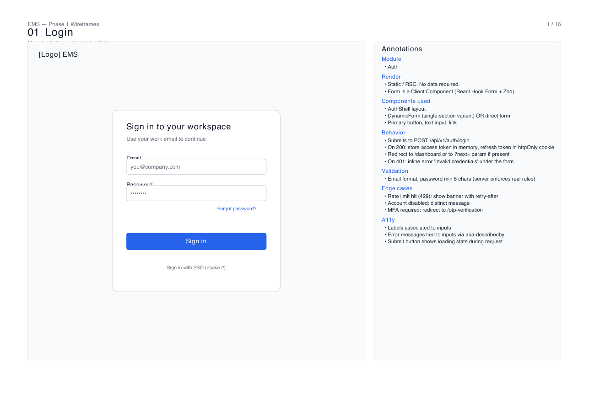

**Goal:** authenticate the user and obtain a JWT access token.

| UI action | Method | Endpoint | Body |
|---|---|---|---|
| Submit form | `POST` | `/auth/login` | `{ "email": "...", "password": "..." }` |
| (Phase 2) MFA redirect | `POST` | `/auth/verify-otp` | `{ "challengeId", "code" }` |

**Implementation notes**
- On `200`: store `data.accessToken` in memory; refresh token is set automatically in an HttpOnly cookie.
- On `401 INVALID_CREDENTIALS`: show "Invalid credentials" under the form.
- On `429`: show rate-limit banner with retry-after.
- Redirect logic after success → see Page 04 / 05 / 06 based on `data.user.memberType`.

---

## Page 02 — Forgot Password

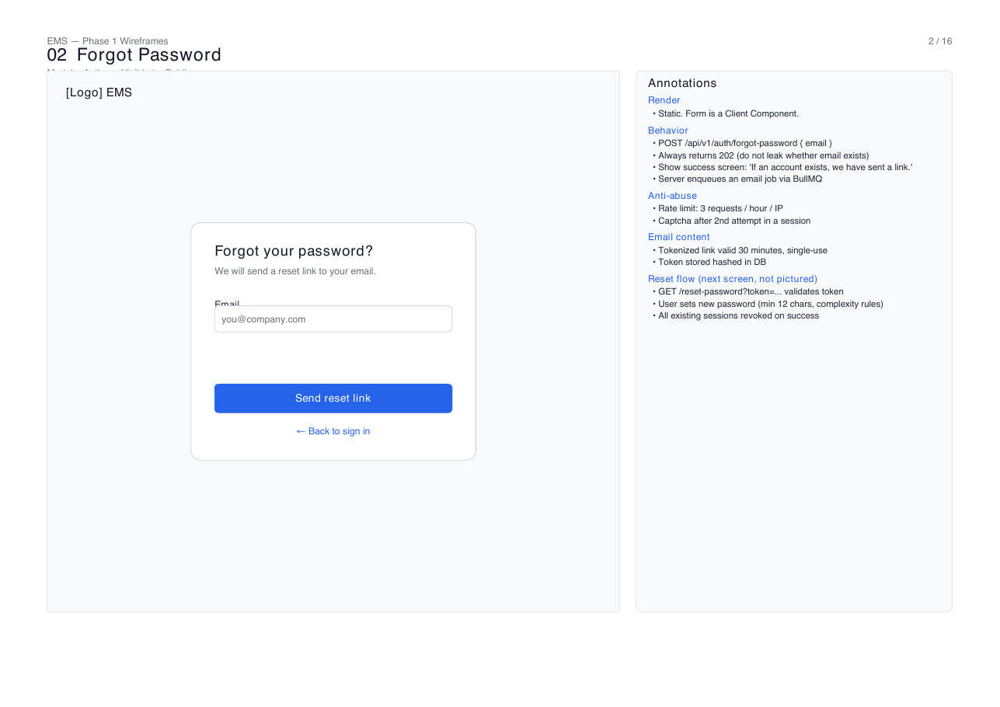

**Goal:** send a one-time password-reset email.

| UI action | Method | Endpoint | Body |
|---|---|---|---|
| Send reset link | `POST` | `/auth/forgot-password` | `{ "email": "..." }` |
| Validate token (next screen) | `GET` | `/auth/validate-reset-token?token=…` | – |
| Set new password (next screen) | `POST` | `/auth/reset-password` | `{ "token", "newPassword" }` |

**Implementation notes**
- Always show "If an account exists, we have sent a link." regardless of whether the email exists — endpoint always returns `202` for this reason.
- Rate-limit: 3/hour/IP (handled server-side, surface `429` as a polite message).

---

## Page 03 — OTP Verification

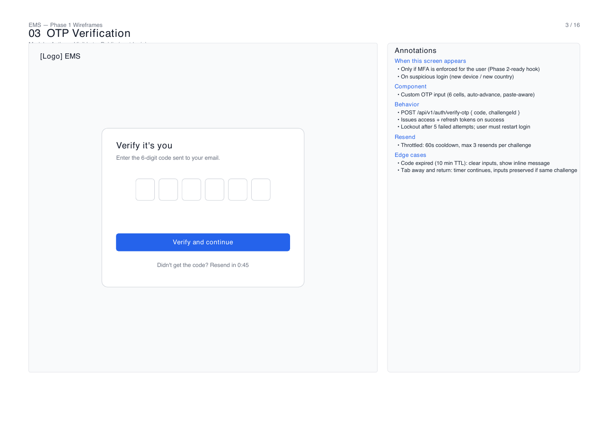

**Goal:** complete MFA challenge issued during login.

| UI action | Method | Endpoint | Body |
|---|---|---|---|
| Verify code | `POST` | `/auth/verify-otp` | `{ "challengeId", "code" }` |
| Resend code | `POST` | `/auth/resend-otp` | `{ "challengeId" }` |

**Implementation notes**
- 6-cell input, auto-advance, paste-aware.
- Lockout after 5 failed attempts (server-enforced).
- Resend throttled to 60s cooldown.

---

## Page 04 — Dashboard (HR Admin)

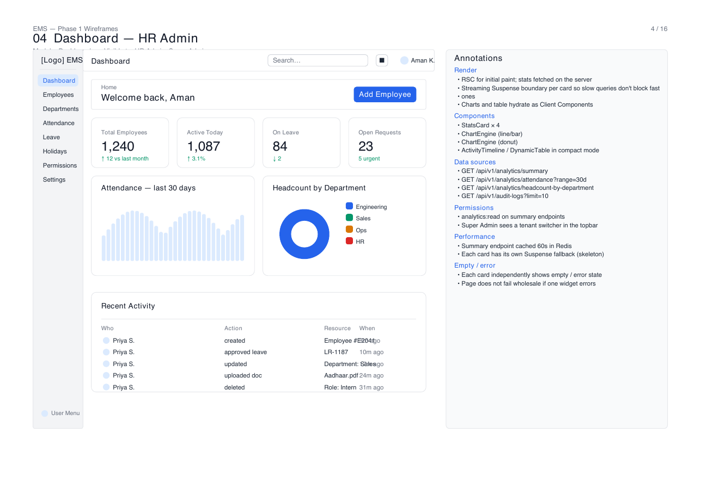

**Test as:** `admin@testorg.com` (HR_ADMIN with employee linked) or `hr@acme.test`.

| Card / Widget | Method | Endpoint | Notes |
|---|---|---|---|
| 4 stat cards (Total / Active Today / On Leave / Open Requests) | `GET` | `/analytics/summary` | Returns all 4 KPIs in one call |
| Attendance — last 30 days chart | `GET` | `/analytics/attendance?range=30d` | Bar chart data |
| Headcount by Department donut | `GET` | `/analytics/headcount-by-department` | Returns `[{ name, count }]` |
| Recent Activity table | `GET` | `/audit-logs?limit=10` | Audit feed |
| "Add Employee" button | – | (opens Page 09) | – |

**Permissions**
- Requires `analytics:read` permission on the user's role. Both `admin@testorg.com` and `hr@acme.test` have it after the 2026-05-19 seed fix.

---

## Page 05 — Dashboard (Manager)

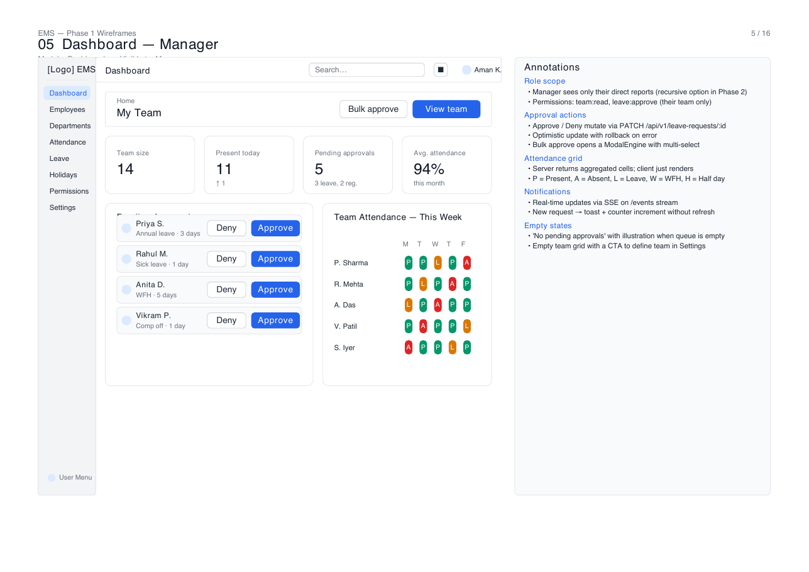

**Test as:** `aman@acme.test` (MANAGER, has 19 direct reports).

| Card / Widget | Method | Endpoint | Notes |
|---|---|---|---|
| Team size / Present today / Pending approvals / Avg attendance | `GET` | `/manager/dashboard` | Single call returns all 4 stats |
| Pending Approvals list | `GET` | `/manager/approvals` | Used for the "Approve / Deny" rows |
| Approve a request | `PATCH` | `/leave/requests/:id/approve` | – |
| Deny a request | `PATCH` | `/leave/requests/:id/reject` | Body: `{ "comment": "..." }` |
| Bulk approve (modal) | loop `PATCH` | `/leave/requests/:id/approve` | Multi-select then iterate |
| Team Attendance grid (M T W T F) | `GET` | `/manager/team/attendance?range=week` | Per-employee daily codes |
| "View team" button | `GET` | `/manager/team` | Team roster |

---

## Page 06 — Dashboard (Employee)

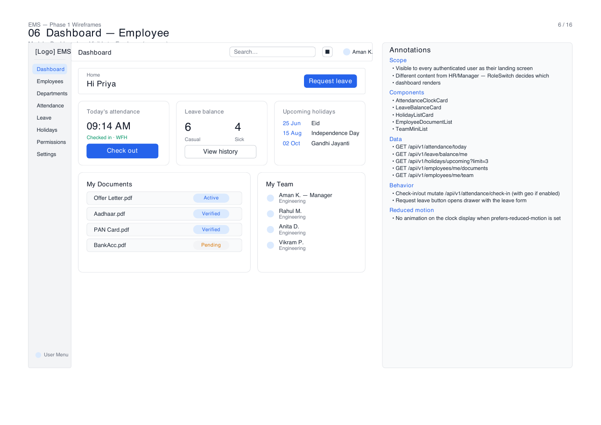

**Test as:** `priya@acme.test` (EMPLOYEE, linked to Priya Sharma E0002).

| Card / Widget | Method | Endpoint | Notes |
|---|---|---|---|
| "Hi Priya" header + Today's attendance card | `GET` | `/employee/dashboard` | Returns employee name, designation, dept, today attendance, pending leaves |
| Check in button | `POST` | `/attendance/check-in` | Body: `{ "workMode": "OFFICE" \| "WFH" }` |
| Check out button | `POST` | `/attendance/check-out` | Body: `{}` |
| Leave balance card | `GET` | `/leave/balance` | Returns array per leave type |
| "View history" → leave history | `GET` | `/leave/requests` | – |
| Upcoming holidays card | `GET` | `/holidays?limit=3` | Returns next 3 holidays |
| My Documents list | `GET` | `/employee/documents` or `/employees/me/documents` | Both paths work |
| My Team mini-list | `GET` | `/employee/team` or `/employees/me/team` | Both paths work |
| Leave type dropdown | `GET` | `/leave/types` | Get leaveTypeId for request form |
| "Request leave" button (drawer) | `POST` | `/leave/requests` | Body: `{ leaveTypeId, startDate, endDate, reason }` |

---

## Page 07 — Employees List

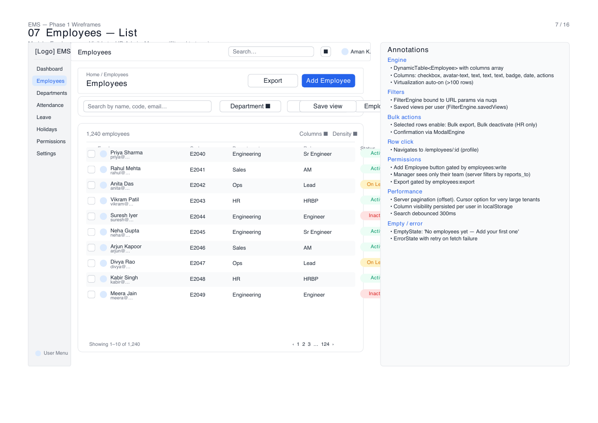

**Test as:** `hr@acme.test` (sees all) or `aman@acme.test` (sees only direct reports).

| UI action | Method | Endpoint | Notes |
|---|---|---|---|
| Load paginated list | `GET` | `/employees?page=1&limit=20` | – |
| Search by name / code / email | `GET` | `/employees?search=priya` | Searches firstName / lastName / employeeCode / workEmail |
| Filter: Department | `GET` | `/employees?departmentId=…` | – |
| Filter: Status | `GET` | `/employees?status=ACTIVE` | Enum: `ACTIVE \| INACTIVE \| ON_LEAVE \| RESIGNED \| TERMINATED` |
| Filter: Location | `GET` | `/employees?location=Delhi` | – |
| Row click → profile | `GET` | `/employees/:id` | (opens Page 08) |
| "Add Employee" button | – | (opens Page 09) | – |
| "Export" button | `GET` | `/employees/export/csv` | Returns CSV file directly |

**Row-level filtering (automatic, no extra params needed)**
- HR_ADMIN / SUPER_ADMIN → see all employees in tenant
- MANAGER → only their direct reports + themselves
- EMPLOYEE → only themselves

---

## Page 08 — Employee Profile

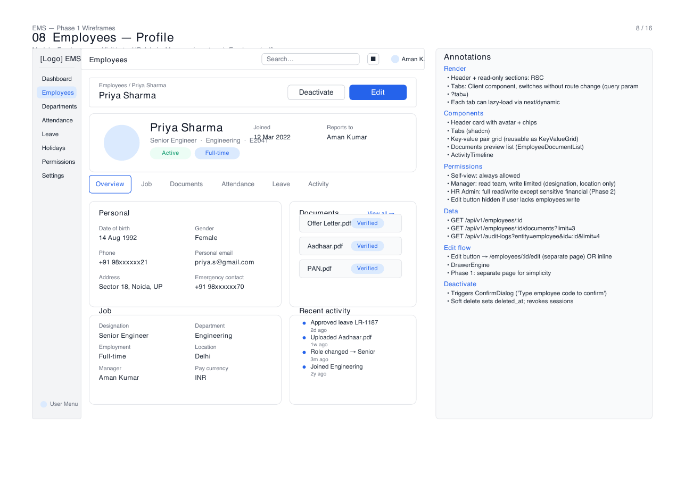

**Test as:** `hr@acme.test` (any profile) or `priya@acme.test` (own profile only).

| Section / Tab | Method | Endpoint | Notes |
|---|---|---|---|
| Header + Personal + Job sections | `GET` | `/employees/:id` | Returns the full Employee row + department + manager |
| Documents tab | `GET` | `/employees/:id/documents?limit=3` | Document list with status chips |
| Attendance tab | `GET` | `/attendance/records?employeeId=:id` | Use Page 11 component for the calendar |
| Leave tab | `GET` | `/leave/requests?employeeId=:id` | Use Page 12 component |
| Activity tab | `GET` | `/audit-logs?entity=employee&id=:id&limit=20` | Filtered to this employee |
| "Edit" button | – | (opens Page 09 with id) | – |
| "Deactivate" button | `PATCH` | `/employees/:id` | Body: `{ "employmentStatus": "INACTIVE" }` |

---

## Page 09 — Employees Create / Edit

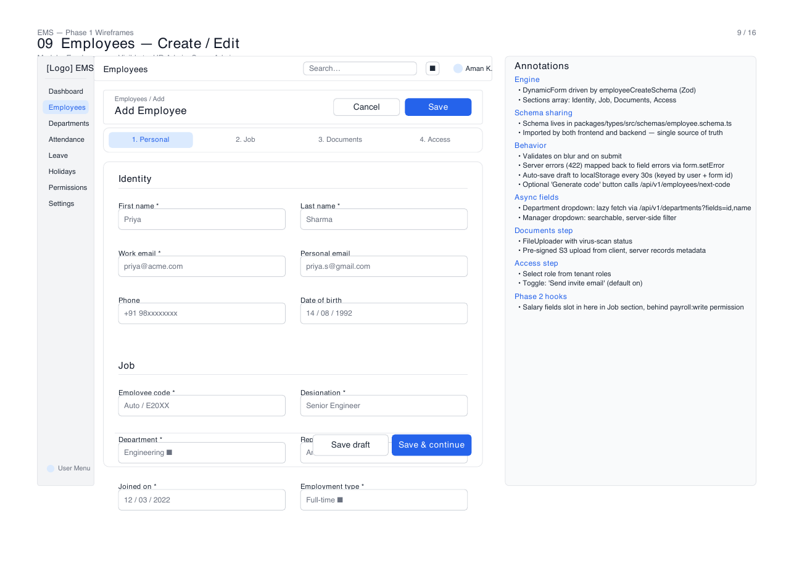

**Test as:** `hr@acme.test` only (MANAGER and EMPLOYEE cannot create).

| UI action | Method | Endpoint | Body |
|---|---|---|---|
| Create employee (final Save) | `POST` | `/employees` | `{ employeeCode, firstName, lastName, workEmail, designation, joinedOn, employmentType, departmentId?, managerId?, … }` |
| Update employee | `PATCH` | `/employees/:id` | Same fields as POST (partial OK) |
| Department dropdown (async) | `GET` | `/departments?fields=id,name` | For the dropdown options |
| Manager dropdown (searchable) | `GET` | `/employees?search=…&limit=10` | Filter by search term |

**Required POST fields:** `employeeCode`, `firstName`, `lastName`, `workEmail`, `designation`, `joinedOn` (ISO date), `employmentType` (`FULL_TIME | PART_TIME | CONTRACT | INTERN`).

---

## Page 10 — Departments

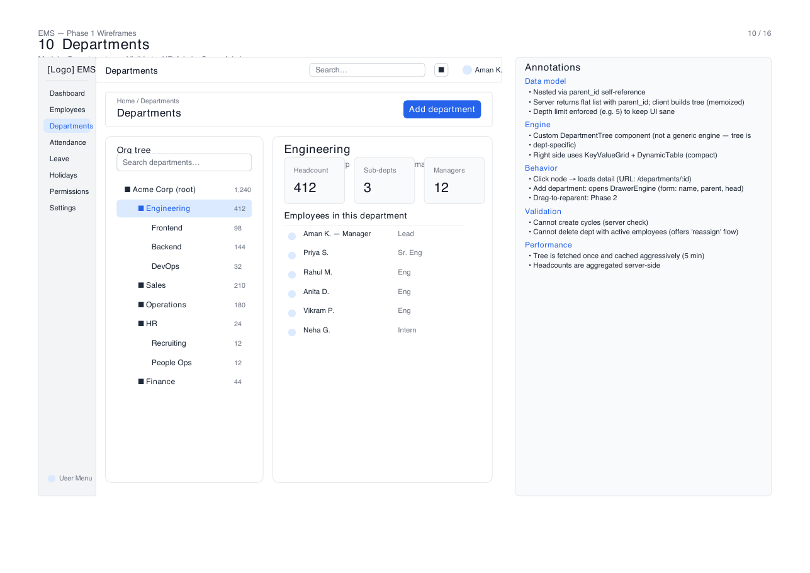

**Test as:** `hr@acme.test` (write) or any role (read tree).

| UI action | Method | Endpoint | Body |
|---|---|---|---|
| Load tree | `GET` | `/departments` | Returns flat list with `parentId` — client builds the tree |
| Department detail (right panel) | `GET` | `/departments/:id` | Includes headcount, sub-dept count, manager count |
| Employees in this department | `GET` | `/employees?departmentId=:id` | – |
| "Add department" (drawer) | `POST` | `/departments` | `{ name, description?, parentId?, headEmployeeId? }` |
| Edit / move parent | `PATCH` | `/departments/:id` | `{ name?, parentId?, headEmployeeId? }` |
| Delete | `DELETE` | `/departments/:id` | Returns conflict if dept has active employees |

---

## Page 11 — Attendance Records

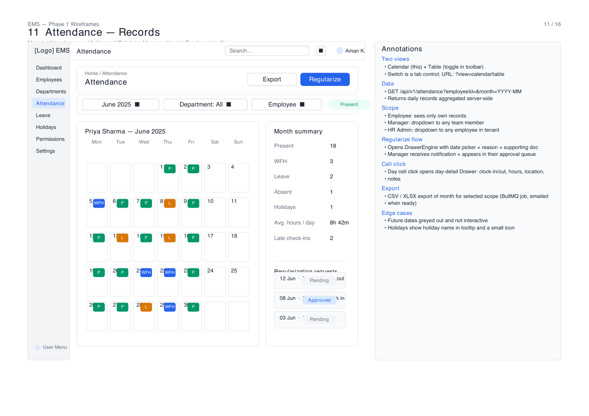

**Test as:** `priya@acme.test` (own), `aman@acme.test` (team), `hr@acme.test` (all).

| View / Action | Method | Endpoint | Notes |
|---|---|---|---|
| Calendar (own records) | `GET` | `/attendance/records?employeeId=…&month=YYYY-MM` | Daily aggregates |
| Team table (manager scope) | `GET` | `/attendance/team/records?month=YYYY-MM&departmentId=…` | – |
| Month summary card | `GET` | `/attendance/summary?employeeId=…&fromDate=…&toDate=…` | Returns `{ present, absent, late, wfh, leave, … }` |
| "Regularize" drawer submit | `POST` | `/attendance/regularization` | `{ date, reason, supportingDocUrl? }` |
| My regularization requests | `GET` | `/attendance/regularization` | – |
| Team regularization queue | `GET` | `/attendance/team/regularization` | Manager only |
| Approve regularization | `PATCH` | `/attendance/regularization/:id/approve` | – |
| Deny regularization | `PATCH` | `/attendance/regularization/:id/deny` | `{ comment }` |
| Export month (CSV/XLSX) | `POST` | `/export/attendance` | Returns 202 + `job_id`; poll `/export/list` |
| Download finished export | `GET` | `/export/:job_id/download` | Stream file |

---

## Page 12 — Leave Requests & Approvals

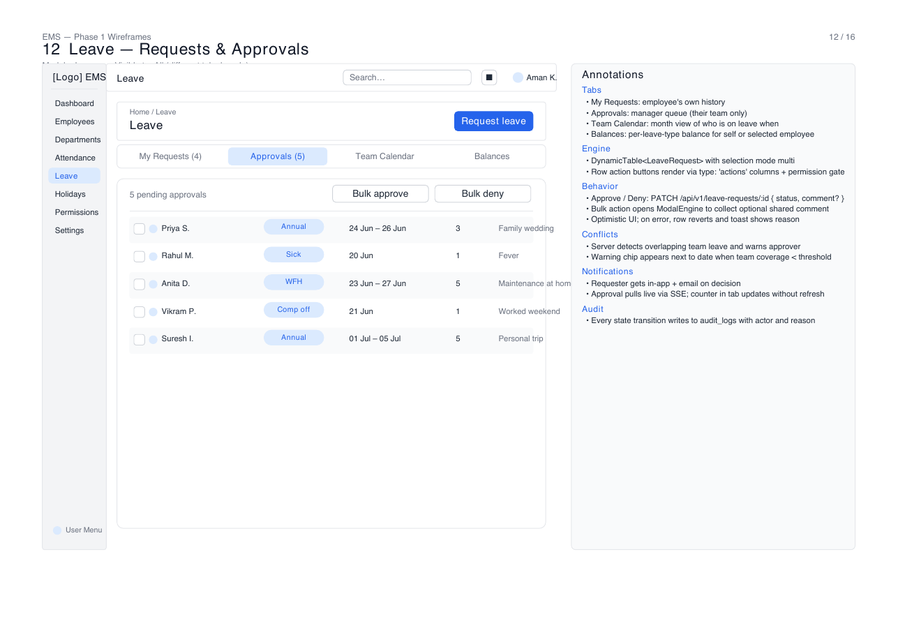

**Test as:** `aman@acme.test` (manager queue) or `priya@acme.test` (own requests).

| Tab / Action | Method | Endpoint | Notes |
|---|---|---|---|
| Tab "My Requests" | `GET` | `/leave/requests` | Employee's own history |
| Tab "Approvals" (manager queue) | `GET` | `/leave/team/requests?status=PENDING` | – |
| Tab "Team Calendar" | `GET` | `/leave/team/requests?month=YYYY-MM` | All approved leaves for the month |
| Tab "Balances" | `GET` | `/leave/balance` | Returns `[{ leaveTypeId, leaveTypeName, total, used, available }]` |
| Leave type dropdown | `GET` | `/leave/types` | Load before showing the request form |
| "Request leave" button (drawer) | `POST` | `/leave/requests` | `{ leaveTypeId, startDate, endDate, reason }` |
| Approve | `PATCH` | `/leave/requests/:id/approve` | – |
| Reject (with comment) | `PATCH` | `/leave/requests/:id/reject` | `{ approverComment }` |
| Withdraw (own) | `PATCH` | `/leave/requests/:id/withdraw` | Only allowed if still PENDING |
| Bulk approve | loop | `PATCH /leave/requests/:id/approve` | Multi-select |

`leaveTypeId` for POST must come from `GET /leave/types` — returns `[{ id, name, code, annualAllowance, isPaid }]`.

---

## Page 13 — Holiday Calendar

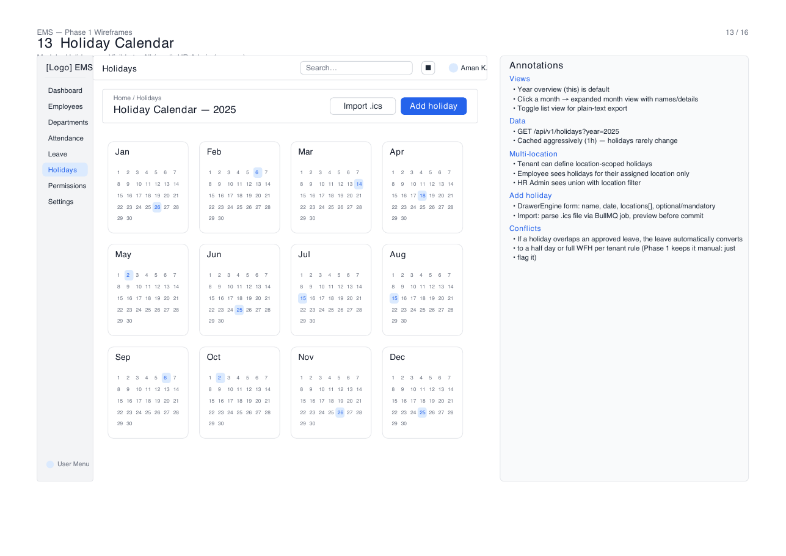

**Test as:** any role (read), `hr@acme.test` (write).

| UI action | Method | Endpoint | Body |
|---|---|---|---|
| Load year view | `GET` | `/holidays?year=2026` | Returns all holidays in the year |
| Toggle list view | `GET` | `/holidays?year=2026&view=list` | – |
| Add holiday (drawer) | `POST` | `/holidays` | `{ name, holidayDate, location?, isOptional? }` |
| Edit holiday | `PATCH` | `/holidays/:id` | Same fields |
| Delete holiday | `DELETE` | `/holidays/:id` | – |
| Import `.ics` | `POST` | `/holidays/import` *(planned)* | Body: `{ icsFile }` |

> Use field name **`holidayDate`** (ISO date), **not** `date`. The Holiday model uses `holidayDate` — this was a bug we fixed on 2026-05-19.

---

## Page 14 — Permissions Matrix

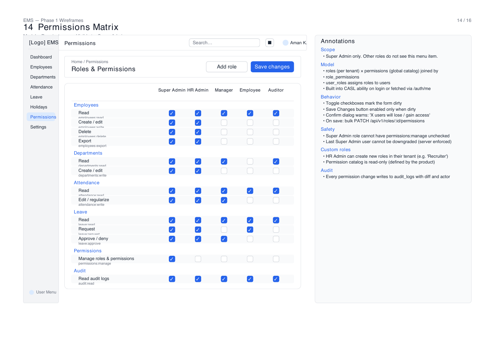

**Test as:** `superadmin@acme.test` only. Other roles get `403 FORBIDDEN`.

| UI action | Method | Endpoint | Body |
|---|---|---|---|
| Load full matrix | `GET` | `/settings/roles-permissions` | Returns `[{ role, permissions: { 'employees:read': true, ... } }]` |
| Save changes (bulk) | `PATCH` | `/settings/roles-permissions` | Body: `{ roles: [{ roleId, permissions: [...] }] }` |
| Add custom role | `POST` | `/settings/roles` *(planned)* | `{ name, basePermissions }` |

**Safety rules (server-enforced):**
- `SUPER_ADMIN` role cannot have `permissions:manage` unchecked.
- Last `SUPER_ADMIN` user cannot be downgraded.

---

## Page 15 — Settings

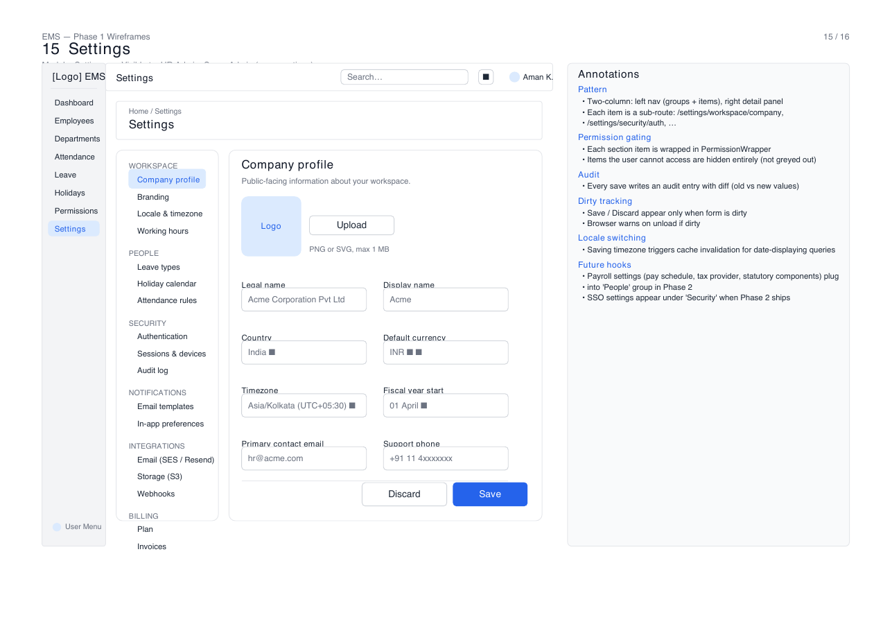

**Test as:** `hr@acme.test` (most items) or `superadmin@acme.test` (all).

| Sidebar group → Item | Method | Endpoint | Notes |
|---|---|---|---|
| WORKSPACE → Company profile | `GET` / `PATCH` | `/settings/tenant` | Name, country, currency, timezone, fiscal year start |
| WORKSPACE → Branding | – | (planned) | – |
| WORKSPACE → Locale & timezone | `PATCH` | `/settings/tenant` | Same endpoint, partial body |
| WORKSPACE → Working hours | `PATCH` | `/settings/tenant` | Body: `{ workingHoursStart, workingHoursEnd }` |
| PEOPLE → Leave types | `GET` | `/settings/leave-types` *(planned)* | – |
| PEOPLE → Holiday calendar | – | (links to Page 13) | – |
| PEOPLE → Attendance rules | – | (planned) | – |
| SECURITY → Authentication | – | (planned MFA toggle) | – |
| SECURITY → Sessions & devices | `GET` | `/auth/sessions` | Returns all active sessions |
|     Revoke a session | `DELETE` | `/auth/sessions/:sessionId` | – |
|     Sign out all devices | `POST` | `/auth/logout-all` | – |
| SECURITY → Audit log | `GET` | `/audit-logs` | Same data as Page 04 Activity card |
| NOTIFICATIONS → Email templates | `GET` / `PATCH` | `/settings/email-templates` | Per-tenant overrides |
| NOTIFICATIONS → In-app preferences | – | (planned) | – |
| INTEGRATIONS → Email / Storage / Webhooks | – | (planned) | – |
| BILLING → Plan / Invoices | – | (planned, Phase 2) | – |

---

## Putting It All Together

**Login flow (every wireframe except 01–03):**

```js
// Step 1: log in once
const r = await fetch('/api/v1/auth/login', {
  method: 'POST',
  headers: { 'Content-Type': 'application/json' },
  body: JSON.stringify({ email, password })  // NO X-Tenant-Key needed
});
const { data } = await r.json();
storeToken(data.accessToken);

// Step 2: route by role
switch (data.user.memberType) {
  case 'SUPER_ADMIN':
  case 'HR_ADMIN':  goto('/dashboard/hr');        break;  // Page 04
  case 'MANAGER':   goto('/dashboard/manager');   break;  // Page 05
  case 'EMPLOYEE':  goto('/dashboard/employee');  break;  // Page 06
}

// Step 3: every subsequent call
fetch('/api/v1/<endpoint>', {
  headers: { Authorization: `Bearer ${token}` }
});
// No X-Tenant-Key — the JWT carries the tenant.
```

**Need to switch users while testing?**
1. Call `POST /auth/logout`
2. Call `POST /auth/login` with the next user
3. Replace your stored token

**See also:**
- [SWAGGER_TESTING_GUIDE.md](./SWAGGER_TESTING_GUIDE.md) — step-by-step Swagger walkthrough with screenshots
- [EMS.postman_collection.json](./EMS.postman_collection.json) — Postman import
- [UI_TEAM_GUIDE.md](./UI_TEAM_GUIDE.md) — same mapping in tabular form without images
