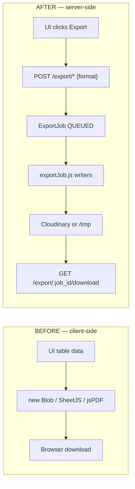
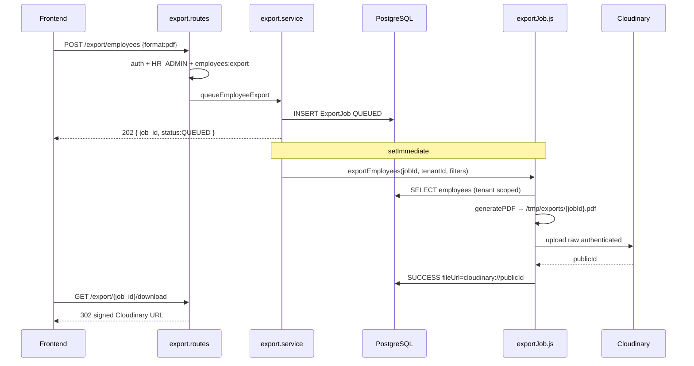
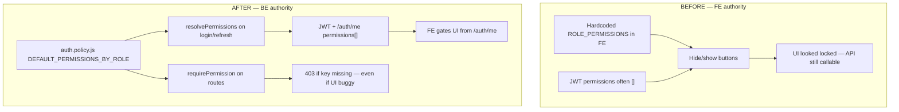
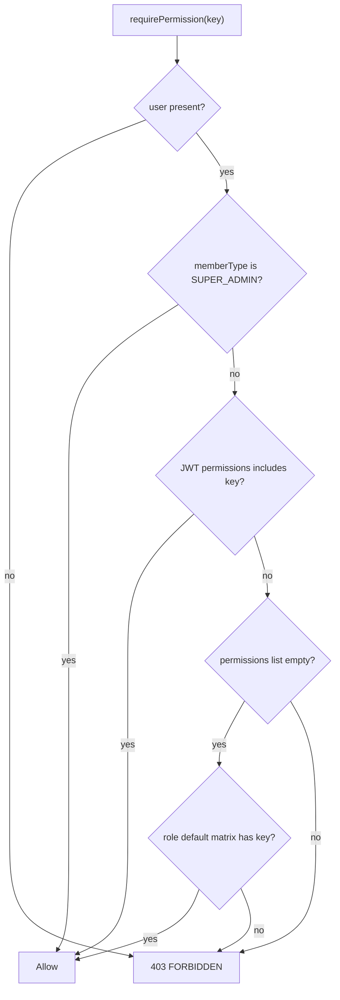
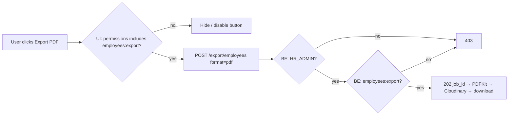

# EMS — Backend Exports & Permissions Deep Dive

> **Separate companion PDF** to the main Technical Documentation.  
> Focus: how CSV / Excel / JSON / PDF generation moved to the **backend**, every library involved, and how **permissions** became backend source-of-truth.  
> Deployed: Hostinger `ems-backend` commit **`68d32f4`** (2026-07-19).  
> Live API: `https://ems-api.saqibsaeed.cloud/api/v1`

---

## 1. Why this document exists

Two UI-side problems were fixed on the backend in the July 2026 Hostinger hardening pass:

| Problem | Old (frontend) | New (backend) |
|---------|----------------|---------------|
| Operational exports | Browser built CSV / Excel / PDF with `Blob`, client libraries, or string concat | Server queues a job, writes the file from live DB rows, stores it, returns download |
| Permission gates | FE hard-coded role→permission matrices; empty JWT `permissions[]` broke gates | `auth.policy.js` is SoT; JWT carries resolved permissions; `requirePermission` enforces on every mutating/export route |

This PDF explains **every library**, **every step**, and **every file** involved — not a summary.

---

## 2. Part A — Moving CSV / Excel / JSON / PDF to the backend

### 2.1 Before vs after (mental model)



**Why the old way was wrong**

1. **Incomplete / stale data** — UI only exported what was already loaded in the grid (pagination truncated rows).
2. **No tenant enforcement on file content** — anything in memory could be dumped.
3. **No permission enforcement on the bytes** — a crafty client could build a file without calling a gated API.
4. **Inconsistent columns** — each screen invented its own CSV headers.
5. **Container-hostile** — large client PDFs burned browser memory; no durable audit of “who exported what”.

**Why the new way is correct**

1. Prisma reads are **tenant-scoped** in `export.repository.js`.
2. Auth is **role + permission** on the route before any job is created.
3. One writer path (`generateExportFile`) for all four formats.
4. Durable storage via Cloudinary (`raw` + `authenticated`) so Docker restarts do not lose files.
5. Audit-friendly: every export creates an `ExportJob` row with `job_id`, type, format, status.

### 2.2 End-to-end timeline (minute detail)

| Step | Who | What happens | Code |
|------|-----|--------------|------|
| 0 | FE | User clicks Export → chooses format | Must **not** use `Blob` |
| 1 | FE → BE | `POST /api/v1/export/employees` body `{ "format": "pdf" }` | `export.routes.js` |
| 2 | Middleware | JWT verify → `authorize(['HR_ADMIN'])` → `requirePermission('employees:export')` | `authenticate.js` + `auth.policy.js` |
| 3 | Controller | Zod-parse body (`csv\|excel\|json\|pdf`) | `export.controller.js` + `export.validator.js` |
| 4 | Service | `uuidv4()` → `createExportJob` status `QUEUED` | `export.service.js` |
| 5 | Service | Return **202** `{ job_id, status: "QUEUED", estimated_completion_time }` immediately | same |
| 6 | Service | `setImmediate(() => exportEmployees(...))` — non-blocking worker | same |
| 7 | Worker | `getEmployeesForExport(tenantId, filters)` — live Postgres | `export.repository.js` |
| 8 | Worker | `generateExportFile(rows, 'employees', format, jobId)` | `exportJob.js` |
| 9a | CSV path | `flattenObject` → `escapeCSV` → `writeFileSync` | `generateCSV` |
| 9b | Excel path | ExcelJS workbook, frozen header `#4F46E5`, alt rows `#F0F0FF` | `generateExcel` |
| 9c | JSON path | `JSON.stringify(data, null, 2)` | `generateJSON` |
| 9d | PDF path | PDFKit landscape A4, indigo header bar, max 8 columns | `generatePDF` |
| 10 | Persist | Read file buffer → Cloudinary upload `resourceType:'raw'`, `type:'authenticated'` → store `cloudinary://{publicId}` | `persistSuccess` |
| 11 | Fallback | If Cloudinary fails → keep local `/tmp/exports/{jobId}.{ext}` URL | same |
| 12 | Status | `ExportJob` → `SUCCESS` + `fileUrl` | repository |
| 13 | FE | `GET /export/{job_id}/download` with Bearer | controller |
| 14a | Download | If `cloudinary://` → **302** to signed URL (300s) | `getSignedDocumentUrl` |
| 14b | Download | Else stream file from disk with `Content-Disposition: attachment` | `createReadStream` |
| 15 | Not ready | If status ≠ SUCCESS → **200** JSON status (poll again) | controller |



### 2.3 Libraries — what / why / how (every one)

| Library | npm | What it is | Why we use it | How EMS uses it |
|---------|-----|------------|---------------|-----------------|
| **ExcelJS** | `exceljs@^4.4.0` | Pure-Node XLSX writer/reader | Styled workbooks without spawning Microsoft Excel or heavy browser SheetJS | `generateExcel()` — frozen header, indigo fill `FF4F46E5`, white bold font, alternating `FFF0F0FF`, auto column width capped at 40, footer “Total: N records” |
| **PDFKit** | `pdfkit@^0.19.1` | Streaming PDF generator | Server PDF without Puppeteer/Chrome; tiny footprint for table exports | `generatePDF()` — `layout:'landscape'`, `size:'A4'`, header bar `#4F46E5`, first **8** columns only (note if more), paginate when `doc.y` near bottom |
| **Cloudinary SDK** | `cloudinary@^2.10.0` | Object storage + signed delivery | Durable files across Docker restarts; private `authenticated` assets | `uploadToCloudinary(buffer, { resourceType:'raw', type:'authenticated', folder: ems/{tenantId}/exports, publicId: jobId })`; download via `private_download_url` (~300s) |
| **Node `fs`** | built-in | Filesystem | Stage bytes before upload; fallback when Cloudinary down | `writeFileSync` / `readFileSync` under `config.exportsDir` or `/tmp/exports` |
| **Prisma** | `@prisma/client` | ORM | Tenant-safe queries + `ExportJob` lifecycle | `getEmployeesForExport` / attendance / leave + create/update job status |
| **uuid** | `uuid@^14` | UUID v4 | Opaque `job_id` clients poll | `uuidv4()` in `queue*Export` |
| **Zod** | `zod@^3.23` | Schema validation | Reject bad `format` / missing date ranges before queue | `export.validator.js` enums `csv\|excel\|json\|pdf` |
| **Fastify** | `fastify@4` | HTTP framework | Route hooks for auth + permission | `onRequest: [authenticate, authorize, requirePermission]` |
| **Pino** | `pino` | Structured logs | Trace queue / success / Cloudinary failure | `type: 'export_queued' \| 'export_completed' \| 'export_uploaded_cloudinary'` |

#### ExcelJS — deeper

- Creates `Workbook` → worksheet titled from export type (`Employees`, `Attendance`, `Leave`).
- `views: [{ state: 'frozen', ySplit: 1 }]` keeps header visible while scrolling in Excel.
- Nested objects are flattened (`department.name` → `department.name`) so one flat table is written.
- Empty dataset → single cell `No data available` (still a valid XLSX).

#### PDFKit — deeper

- Collects PDF chunks via `doc.on('data')`, concatenates, writes once on `end`.
- Landscape chosen so more columns fit; still capped at 8 for readability.
- Doc explicitly tells operators: *use Excel/CSV for full width* when columns > 8.
- Alternating row tint `#F0F0FF` matches Excel branding.

#### Cloudinary — deeper

- Prefix stored in DB: `cloudinary://` + `public_id` (not a permanent public HTTP URL).
- Delivery type **`authenticated`** means anonymous URL fetch returns 401.
- Download route mints a **short-lived signed** URL; FE should follow redirects (`curl -L` / browser).
- If signing fails → fall back to local disk stream if file still on container.

### 2.4 Per-format file contract

| `format` body | On-disk / download name | MIME | Generator | Notes |
|---------------|-------------------------|------|-----------|-------|
| `csv` | `{jobId}.csv` | `text/csv` | `generateCSV` | RFC quoting for `,` `"` newlines; empty file if 0 rows |
| `excel` | `{jobId}.xlsx` | OOXML spreadsheet | `generateExcel` | ExcelJS; not CSV-with-.xls |
| `json` | `{jobId}.json` | `application/json` | `generateJSON` | Pretty nested objects (not flattened) |
| `pdf` | `{jobId}.pdf` | `application/pdf` | `generatePDF` | Landscape A4 PDFKit |

### 2.5 API surface (only these)

| Method | Path | Auth | Body / query | HTTP |
|--------|------|------|--------------|------|
| POST | `/api/v1/export/employees` | HR_ADMIN + `employees:export` | `format`, optional `department_id`, `status`, `include_archived` | **202** |
| POST | `/api/v1/export/attendance` | same | **requires** `from_date`, `to_date` + `format` | **202** |
| POST | `/api/v1/export/leave` | same | **requires** `from_date`, `to_date` + `format` | **202** |
| GET | `/api/v1/export/:job_id/download` | same | — | **200** stream / **302** signed / **200** status JSON |
| GET | `/api/v1/export/list` | authenticated | `page`, `limit`, `status` | **200** |

**202 body:**

```json
{
  "success": true,
  "data": {
    "job_id": "01a08046-e986-4a97-bbfe-68c3f042e8a3",
    "status": "QUEUED",
    "estimated_completion_time": 2
  }
}
```

### 2.6 Source map (do not invent new paths)

| Layer | File |
|-------|------|
| Routes + dual auth | `src/modules/export/export.routes.js` |
| HTTP + MIME + 302 | `src/modules/export/export.controller.js` |
| Queue + `setImmediate` | `src/modules/export/export.service.js` |
| Prisma + ExportJob | `src/modules/export/export.repository.js` |
| Zod | `src/modules/export/export.validator.js` |
| CSV/Excel/JSON/PDF + Cloudinary persist | `src/jobs/exportJob.js` |
| Cloudinary helpers | `src/utils/cloudinary.js` |
| Permission gate | `src/modules/auth/auth.policy.js` |

### 2.7 What the frontend must delete / change

1. Delete `new Blob([csvString])`, client SheetJS, client jsPDF for **employees / attendance / leave** operational exports.
2. Call `POST /export/*` → store `job_id` → open/poll `GET /export/:job_id/download`.
3. Never use legacy `/files/:jobId`.
4. Hide Export buttons unless `/auth/me` includes `employees:export` (and role allows).
5. Contract file: `docs/UI_CONTRACT_server_exports_permissions_realtime_logs.md`.

### 2.8 Live curl examples (Hostinger)

```bash
BASE=https://ems-api.saqibsaeed.cloud/api/v1
TOKEN=$(curl -s -X POST $BASE/auth/login \
  -H 'content-type: application/json' -H 'x-tenant-key: acme-corp-001' \
  -d '{"email":"hr@acme.test","password":"Password123!"}' \
  | python3 -c 'import sys,json; print(json.load(sys.stdin)["data"]["accessToken"])')

# CSV
curl -s -X POST $BASE/export/employees -H "Authorization: Bearer $TOKEN" \
  -H 'content-type: application/json' -d '{"format":"csv"}'

# Excel
curl -s -X POST $BASE/export/employees -H "Authorization: Bearer $TOKEN" \
  -H 'content-type: application/json' -d '{"format":"excel","status":"ACTIVE"}'

# PDF
curl -s -X POST $BASE/export/employees -H "Authorization: Bearer $TOKEN" \
  -H 'content-type: application/json' -d '{"format":"pdf"}'

# JSON attendance (dates required)
curl -s -X POST $BASE/export/attendance -H "Authorization: Bearer $TOKEN" \
  -H 'content-type: application/json' \
  -d '{"format":"json","from_date":"2026-07-01","to_date":"2026-07-19"}'

# Download (follow 302)
curl -sL -o /tmp/ems-export.bin -H "Authorization: Bearer $TOKEN" \
  "$BASE/export/<JOB_ID>/download"

# Employee denied
EMP=$(curl -s -X POST $BASE/auth/login -H 'content-type: application/json' \
  -H 'x-tenant-key: acme-corp-001' \
  -d '{"email":"priya@acme.test","password":"Password123!"}' \
  | python3 -c 'import sys,json; print(json.load(sys.stdin)["data"]["accessToken"])')
curl -s -o /dev/null -w '%{http_code}\n' -X POST $BASE/export/employees \
  -H "Authorization: Bearer $EMP" -H 'content-type: application/json' -d '{"format":"csv"}'
# → 403
```

**Proven live (2026-07-19 via Vercel BFF):** HR → **202 QUEUED**; Employee → **403 FORBIDDEN**.

---

## 3. Part B — Moving permissions to the backend (source of truth)

### 3.1 Before vs after



**Why FE-as-authority failed**

1. Empty `permissions[]` in JWT made FE hide everything or fall back to wrong constants.
2. Changing the matrix in Settings UI did not change what the API allowed until BE enforced keys.
3. Security cannot depend on CSS/`if (role === 'HR')` in React — anyone can call `curl`.

**What “moved to backend” means**

1. **Canonical defaults** live in `src/modules/auth/auth.policy.js` → `DEFAULT_PERMISSIONS_BY_ROLE`.
2. **Login / refresh / me** call `resolvePermissions(user)`:
   - Prefer explicit `RolePermission` rows from DB.
   - Else fall back to the default matrix for `memberType`.
3. **Route enforcement** via `requirePermission('employees:export')` (and write/delete keys on employee mutations).
4. **Settings API** still lets SUPER_ADMIN PATCH the matrix; seed runs **once** per tenant so customizations are never overwritten.
5. FE must **display** from `/auth/me` and **never** treat local constants as authority.

### 3.2 Permission catalogue (exact keys)

| Key | Module | Meaning |
|-----|--------|---------|
| `employees:read` | employees | View employees |
| `employees:write` | employees | Create / update |
| `employees:delete` | employees | Soft delete |
| `employees:export` | employees | Queue/download exports |
| `departments:read` | departments | View |
| `departments:write` | departments | Manage |
| `attendance:read` | attendance | View |
| `attendance:write` | attendance | Mutate |
| `leave:read` | leave | View |
| `leave:request` | leave | Request |
| `leave:approve` | leave | Approve / deny |
| `analytics:read` | analytics | View analytics |
| `audit:read` | audit | View audit logs |
| `permissions:manage` | settings | Edit role matrix |

### 3.3 Default grants by role (day-1)

| Role | Defaults |
|------|----------|
| **SUPER_ADMIN** | All keys including `permissions:manage`. Also bypasses `hasPermission` checks. |
| **HR_ADMIN** | employees CRUD+export, departments r/w, attendance r/w, leave r/request/approve, analytics, audit — **not** `permissions:manage` |
| **MANAGER** | employees:read, departments:read, attendance r/w, leave r/request/approve, analytics:read — **no export** |
| **EMPLOYEE** | employees:read, departments:read, attendance r/w, leave read/request — **no export** |
| **AUDITOR** | read-only employees/departments/attendance/leave + analytics + audit |

### 3.4 Decision algorithm (`hasPermission`)


This empty-token fallback exists so **old JWTs minted before seed** do not lock out HR on day-1. After refresh, tokens carry the full list.

### 3.5 Where permissions attach on login

1. User authenticates → load user + roles/permissions relations.
2. `resolvePermissions(user)` → string array.
3. Array embedded in access token claims **and** returned from `GET /auth/me`.
4. Every protected export/write route re-checks with `requirePermission` using `request.user` from JWT.

### 3.6 Dual gate on exports (role AND permission)

```js
// export.routes.js — both required
onRequest: [
  authenticate,
  authorize(['HR_ADMIN']),          // role enum
  requirePermission('employees:export'), // fine-grained key
]
```

| Actor | Role OK? | `employees:export`? | Result |
|-------|----------|---------------------|--------|
| HR_ADMIN with default grants | yes | yes | **202** |
| HR_ADMIN after admin removes export key + refreshed token | yes | no | **403** |
| EMPLOYEE | no | no | **403** (authorize or permission) |
| SUPER_ADMIN | bypass | bypass | allowed |

### 3.7 Settings matrix (admin UI)

| Method | Path | Who | Effect |
|--------|------|-----|--------|
| GET | `/settings/roles-permissions` | SUPER_ADMIN | Read matrix |
| PATCH | `/settings/roles-permissions` | SUPER_ADMIN + `permissions:manage` | Update RolePermission rows |

After PATCH: FE must **refresh token or re-login**. Until then UI may look stale; **backend still enforces the new grants** on the next request that carries an updated JWT. Requests with old JWT keep old grants until expiry/refresh.

Seed helper: `ensureTenantRolePermissionDefaults` — runs once (`setting` flag `role_permissions_defaults_seeded`); never wipes admin customizations later.

### 3.8 Source map — permissions

| Concern | File |
|---------|------|
| Defaults + `requirePermission` + `hasPermission` | `src/modules/auth/auth.policy.js` |
| `resolvePermissions` + catalogue seed | `src/modules/auth/auth.service.js` |
| Role authorize middleware | `src/middleware/authenticate.js` |
| Export dual gate | `src/modules/export/export.routes.js` |
| Employee write/delete/export gates | `src/modules/employees/employees.routes.js` |
| Settings matrix API | `src/modules/settings/settings.*.js` |

### 3.9 Frontend contract for permissions

1. **Do not** hardcode default matrices as authority.
2. Gate buttons/menus from `/auth/me` → `permissions[]` (+ `memberType`).
3. After PATCH roles-permissions → force refresh/login.
4. Expect **403** with body `{ requiredPermission, userRole }` when key missing — show a clear message, do not retry as Blob export.

---

## 4. How the two moves work together



- UI gate = UX.
- Backend gate = security.
- File bytes = always generated on server with tenant-scoped Prisma + ExcelJS/PDFKit.

---

## 5. Verification checklist

| # | Check | Expected |
|---|-------|----------|
| 1 | HR `POST .../export/employees` `{format:csv\|excel\|json\|pdf}` | **202** + `job_id` |
| 2 | `GET .../export/{job_id}/download` after ~1–2s | file or **302** |
| 3 | EMP same POST | **403** |
| 4 | Remove `employees:export` from HR via settings → refresh token → export | **403** |
| 5 | Restore permission → export | **202** again |
| 6 | `/auth/me` for HR | `permissions` includes `employees:export` |
| 7 | No client `Blob` for operational exports in FE | code review |

---

## 6. Related docs

| Doc | Use |
|-----|-----|
| `docs/EMS_BACKEND_TECHNICAL_DOCUMENTATION.pdf` | Full system tech doc (v3.1) — §10.4 / §10.5 |
| `docs/UI_CONTRACT_server_exports_permissions_realtime_logs.md` | FE must-do contract |
| `docs/BACKEND_CHANGELOG_hostinger_hardening_2026-07-19.md` | Changelog |
| `docs/LIVE_UI_ROLE_MATRIX_VERCEL_2026-07-19.md` | Live HR 202 / EMP 403 proof |
| `docs/UI_TEAM_HANDOFF_HOSTINGER_HARDENING_2026-07-19.md` | Handoff index |

---

## 7. Revision

| Date | Version | Notes |
|------|---------|-------|
| 2026-07-22 | 1.0 | Dedicated deep-dive PDF: backend exports (all libraries + steps) + permissions SoT migration |
