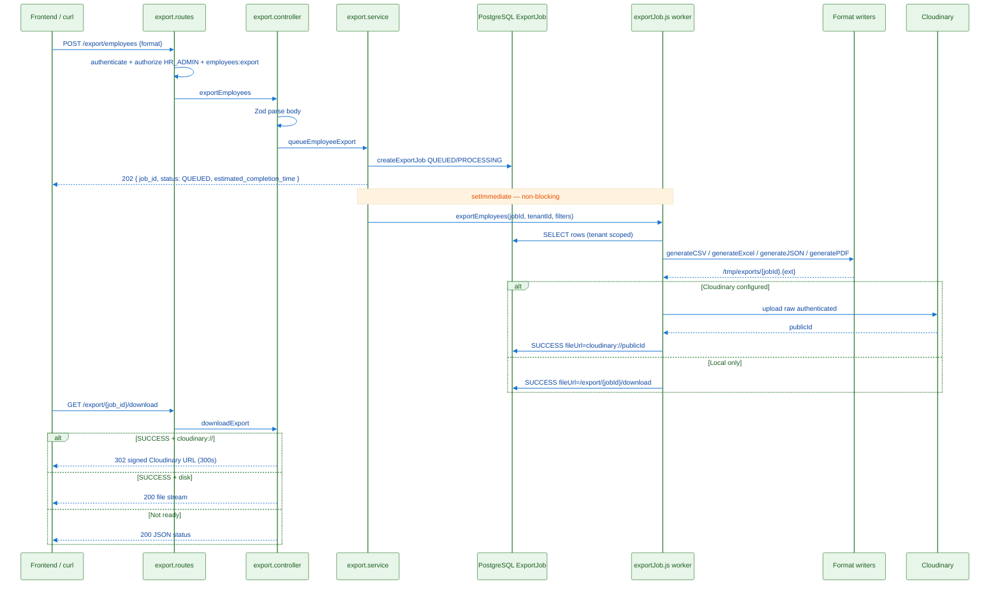
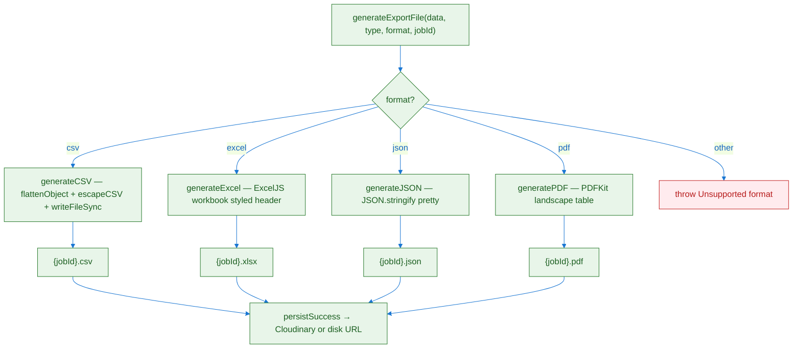
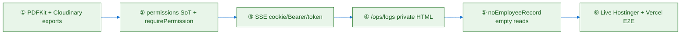

### 10.4 Server-Side Dynamic Export Generation (CSV / Excel / JSON / PDF)

<blockquote style="background:#e8f5e9;border-left:4px solid #2e7d32;padding:12px 16px;margin:16px 0;">
<strong>In simple terms:</strong> The UI never builds files in the browser. It asks the API to queue a job; the server pulls live DB rows, writes CSV/Excel/JSON/PDF, optionally uploads to Cloudinary, then the UI downloads by <code>job_id</code>.
</blockquote>

> **What it does:** Dynamically generates employee, attendance, and leave export files from live PostgreSQL data.  
> **Why it matters:** Correct columns, tenant isolation, permission gates, and durable storage — no client-side Blob spoofing.  
> **How it works:** `POST /export/*` → `ExportJob` row → `setImmediate` worker in `exportJob.js` → format writers → Cloudinary/disk → `GET /export/:job_id/download`.  
> **Live since:** Hostinger commit `68d32f4` (2026-07-19).  
> **Auth:** `HR_ADMIN` (+ `SUPER_ADMIN` bypass) **and** permission `employees:export`.

#### 10.4.1 Libraries — What / Why / How

<table style="width:100%;border-collapse:collapse;margin:12px 0;font-size:0.92em;">
<thead><tr><th style="background:#1565c0;color:#fff;padding:8px 10px;text-align:left;border:1px solid #0d47a1;">Library</th><th style="background:#1565c0;color:#fff;padding:8px 10px;text-align:left;border:1px solid #0d47a1;">What</th><th style="background:#1565c0;color:#fff;padding:8px 10px;text-align:left;border:1px solid #0d47a1;">Why we use it</th><th style="background:#1565c0;color:#fff;padding:8px 10px;text-align:left;border:1px solid #0d47a1;">How it is used</th></tr></thead><tbody>
<tr><td style="background:#f5f9ff;padding:8px 10px;border:1px solid #e0e0e0;vertical-align:top;"><strong>ExcelJS</strong></td><td style="background:#f5f9ff;padding:8px 10px;border:1px solid #e0e0e0;vertical-align:top;">Node XLSX writer</td><td style="background:#f5f9ff;padding:8px 10px;border:1px solid #e0e0e0;vertical-align:top;">Styled workbooks (frozen header, indigo header fill, alternating rows, auto column width) without spawning Excel</td><td style="background:#f5f9ff;padding:8px 10px;border:1px solid #e0e0e0;vertical-align:top;"><code>generateExcel()</code> in <code>src/jobs/exportJob.js</code> → <code>workbook.xlsx.writeFile()</code></td></tr>
<tr><td style="background:#ffffff;padding:8px 10px;border:1px solid #e0e0e0;vertical-align:top;"><strong>PDFKit</strong></td><td style="background:#ffffff;padding:8px 10px;border:1px solid #e0e0e0;vertical-align:top;">Streaming PDF generator</td><td style="background:#ffffff;padding:8px 10px;border:1px solid #e0e0e0;vertical-align:top;">Server-side PDF without headless Chrome; small dependency; table layout for ops exports</td><td style="background:#ffffff;padding:8px 10px;border:1px solid #e0e0e0;vertical-align:top;"><code>generatePDF()</code> — landscape A4, header bar <code>#4F46E5</code>, first 8 columns, paginated rows</td></tr>
<tr><td style="background:#f5f9ff;padding:8px 10px;border:1px solid #e0e0e0;vertical-align:top;"><strong>Node fs</strong></td><td style="background:#f5f9ff;padding:8px 10px;border:1px solid #e0e0e0;vertical-align:top;">Filesystem API</td><td style="background:#f5f9ff;padding:8px 10px;border:1px solid #e0e0e0;vertical-align:top;">Write CSV/JSON buffers and stage files before Cloudinary upload</td><td style="background:#f5f9ff;padding:8px 10px;border:1px solid #e0e0e0;vertical-align:top;"><code>writeFileSync</code> under <code>EXPORTS_DIR</code> (<code>/tmp/exports</code> or <code>config.exportsDir</code>)</td></tr>
<tr><td style="background:#ffffff;padding:8px 10px;border:1px solid #e0e0e0;vertical-align:top;"><strong>Cloudinary SDK</strong></td><td style="background:#ffffff;padding:8px 10px;border:1px solid #e0e0e0;vertical-align:top;">Object storage CDN</td><td style="background:#ffffff;padding:8px 10px;border:1px solid #e0e0e0;vertical-align:top;">Durable authenticated <code>raw</code> assets; survives container restarts; signed short-lived download URLs</td><td style="background:#ffffff;padding:8px 10px;border:1px solid #e0e0e0;vertical-align:top;"><code>persistSuccess()</code> uploads buffer; stores <code>cloudinary://{publicId}</code> in <code>ExportJob.fileUrl</code></td></tr>
<tr><td style="background:#f5f9ff;padding:8px 10px;border:1px solid #e0e0e0;vertical-align:top;"><strong>Prisma</strong></td><td style="background:#f5f9ff;padding:8px 10px;border:1px solid #e0e0e0;vertical-align:top;">ORM</td><td style="background:#f5f9ff;padding:8px 10px;border:1px solid #e0e0e0;vertical-align:top;">Tenant-scoped reads for export datasets + job status rows</td><td style="background:#f5f9ff;padding:8px 10px;border:1px solid #e0e0e0;vertical-align:top;"><code>export.repository.js</code> <code>getEmployeesForExport</code> / attendance / leave + <code>ExportJob</code> CRUD</td></tr>
<tr><td style="background:#ffffff;padding:8px 10px;border:1px solid #e0e0e0;vertical-align:top;"><strong>uuid</strong></td><td style="background:#ffffff;padding:8px 10px;border:1px solid #e0e0e0;vertical-align:top;">ID generator</td><td style="background:#ffffff;padding:8px 10px;border:1px solid #e0e0e0;vertical-align:top;">Opaque <code>job_id</code> for poll/download URLs</td><td style="background:#ffffff;padding:8px 10px;border:1px solid #e0e0e0;vertical-align:top;"><code>uuidv4()</code> in <code>export.service.js</code> queue helpers</td></tr>
<tr><td style="background:#f5f9ff;padding:8px 10px;border:1px solid #e0e0e0;vertical-align:top;"><strong>Zod</strong> (validator)</td><td style="background:#f5f9ff;padding:8px 10px;border:1px solid #e0e0e0;vertical-align:top;">Schema validation</td><td style="background:#f5f9ff;padding:8px 10px;border:1px solid #e0e0e0;vertical-align:top;">Reject bad <code>format</code> / missing date ranges before queueing</td><td style="background:#f5f9ff;padding:8px 10px;border:1px solid #e0e0e0;vertical-align:top;"><code>export.validator.js</code> — <code>format: csv|excel|json|pdf</code></td></tr>
<tr><td style="background:#ffffff;padding:8px 10px;border:1px solid #e0e0e0;vertical-align:top;"><strong>auth.policy</strong></td><td style="background:#ffffff;padding:8px 10px;border:1px solid #e0e0e0;vertical-align:top;">Permission middleware</td><td style="background:#ffffff;padding:8px 10px;border:1px solid #e0e0e0;vertical-align:top;">Fine-grained gate beyond role enum</td><td style="background:#ffffff;padding:8px 10px;border:1px solid #e0e0e0;vertical-align:top;"><code>requirePermission('employees:export')</code> on export routes</td></tr>
</tbody></table>

#### 10.4.2 End-to-End Flow (all formats)



#### 10.4.3 Format Decision Tree



#### 10.4.4 Per-Format Behavior

<table style="width:100%;border-collapse:collapse;margin:12px 0;font-size:0.92em;">
<thead><tr><th style="background:#1565c0;color:#fff;padding:8px 10px;text-align:left;border:1px solid #0d47a1;">format</th><th style="background:#1565c0;color:#fff;padding:8px 10px;text-align:left;border:1px solid #0d47a1;">File</th><th style="background:#1565c0;color:#fff;padding:8px 10px;text-align:left;border:1px solid #0d47a1;">MIME</th><th style="background:#1565c0;color:#fff;padding:8px 10px;text-align:left;border:1px solid #0d47a1;">Generation details</th></tr></thead><tbody>
<tr><td style="background:#f5f9ff;padding:8px 10px;border:1px solid #e0e0e0;vertical-align:top;"><code>csv</code></td><td style="background:#f5f9ff;padding:8px 10px;border:1px solid #e0e0e0;vertical-align:top;"><code>{jobId}.csv</code></td><td style="background:#f5f9ff;padding:8px 10px;border:1px solid #e0e0e0;vertical-align:top;"><code>text/csv</code></td><td style="background:#f5f9ff;padding:8px 10px;border:1px solid #e0e0e0;vertical-align:top;">Flatten nested objects; RFC-style quoting for commas/quotes/newlines; empty file if zero rows</td></tr>
<tr><td style="background:#ffffff;padding:8px 10px;border:1px solid #e0e0e0;vertical-align:top;"><code>excel</code></td><td style="background:#ffffff;padding:8px 10px;border:1px solid #e0e0e0;vertical-align:top;"><code>{jobId}.xlsx</code></td><td style="background:#ffffff;padding:8px 10px;border:1px solid #e0e0e0;vertical-align:top;">OOXML spreadsheet</td><td style="background:#ffffff;padding:8px 10px;border:1px solid #e0e0e0;vertical-align:top;">Frozen header row; indigo <code>#4F46E5</code> header; alternating <code>#F0F0FF</code> rows; summary footer with record count</td></tr>
<tr><td style="background:#f5f9ff;padding:8px 10px;border:1px solid #e0e0e0;vertical-align:top;"><code>json</code></td><td style="background:#f5f9ff;padding:8px 10px;border:1px solid #e0e0e0;vertical-align:top;"><code>{jobId}.json</code></td><td style="background:#f5f9ff;padding:8px 10px;border:1px solid #e0e0e0;vertical-align:top;"><code>application/json</code></td><td style="background:#f5f9ff;padding:8px 10px;border:1px solid #e0e0e0;vertical-align:top;">Pretty-printed array of original (nested) row objects</td></tr>
<tr><td style="background:#ffffff;padding:8px 10px;border:1px solid #e0e0e0;vertical-align:top;"><code>pdf</code></td><td style="background:#ffffff;padding:8px 10px;border:1px solid #e0e0e0;vertical-align:top;"><code>{jobId}.pdf</code></td><td style="background:#ffffff;padding:8px 10px;border:1px solid #e0e0e0;vertical-align:top;"><code>application/pdf</code></td><td style="background:#ffffff;padding:8px 10px;border:1px solid #e0e0e0;vertical-align:top;">Landscape A4; title + timestamp; table up to 8 columns; note if more columns exist (use Excel/CSV for full width)</td></tr>
</tbody></table>

#### 10.4.5 API Surface

| Method | Path | Body highlights | HTTP |
|--------|------|-----------------|------|
| POST | `/api/v1/export/employees` | `{ "format": "csv\|excel\|json\|pdf", "department_id?", "status?", "include_archived?" }` | **202** |
| POST | `/api/v1/export/attendance` | requires `from_date`, `to_date` + `format` | **202** |
| POST | `/api/v1/export/leave` | requires `from_date`, `to_date` + `format` | **202** |
| GET | `/api/v1/export/:job_id/download` | — | **200** stream / **302** signed URL / **200** status JSON |
| GET | `/api/v1/export/list` | `?page&limit&status` | **200** (tenant-wide list today) |

**202 response shape:**

```json
{
  "success": true,
  "data": {
    "job_id": "01a08046-e986-4a97-bbfe-68c3f042e8a3",
    "status": "QUEUED",
    "estimated_completion_time": 2
  }
}
```

#### 10.4.6 Live Examples (Hostinger)

Base: `https://ems-api.saqibsaeed.cloud/api/v1`  
Tenant: `x-tenant-key: acme-corp-001`  
Login: `hr@acme.test` / `Password123!`

**Step 1 — Login**

```bash
TOKEN=$(curl -s -X POST https://ems-api.saqibsaeed.cloud/api/v1/auth/login \
  -H 'content-type: application/json' \
  -H 'x-tenant-key: acme-corp-001' \
  -d '{"email":"hr@acme.test","password":"Password123!"}' \
  | python3 -c 'import sys,json; print((json.load(sys.stdin).get("data") or {}).get("accessToken") or "")')
echo "token_len=${#TOKEN}"
```

**Step 2a — Employees CSV**

```bash
JOB=$(curl -s -X POST https://ems-api.saqibsaeed.cloud/api/v1/export/employees \
  -H "Authorization: Bearer $TOKEN" -H 'content-type: application/json' \
  -d '{"format":"csv"}')
echo "$JOB"
# → 202 { "data": { "job_id": "<uuid>", "status": "QUEUED", ... } }
```

**Step 2b — Employees Excel**

```bash
curl -s -X POST https://ems-api.saqibsaeed.cloud/api/v1/export/employees \
  -H "Authorization: Bearer $TOKEN" -H 'content-type: application/json' \
  -d '{"format":"excel","status":"ACTIVE"}'
```

**Step 2c — Employees PDF**

```bash
curl -s -X POST https://ems-api.saqibsaeed.cloud/api/v1/export/employees \
  -H "Authorization: Bearer $TOKEN" -H 'content-type: application/json' \
  -d '{"format":"pdf"}'
```

**Step 2d — Attendance JSON (date range required)**

```bash
curl -s -X POST https://ems-api.saqibsaeed.cloud/api/v1/export/attendance \
  -H "Authorization: Bearer $TOKEN" -H 'content-type: application/json' \
  -d '{"format":"json","from_date":"2026-07-01","to_date":"2026-07-19"}'
```

**Step 2e — Leave Excel**

```bash
curl -s -X POST https://ems-api.saqibsaeed.cloud/api/v1/export/leave \
  -H "Authorization: Bearer $TOKEN" -H 'content-type: application/json' \
  -d '{"format":"excel","from_date":"2026-06-01","to_date":"2026-07-19","status":"APPROVED"}'
```

**Step 3 — Poll / download**

```bash
JOB_ID="<paste-job_id>"
# Follow redirects (-L) for Cloudinary 302
curl -sL -o /tmp/ems-export.bin -w 'http=%{http_code} type=%{content_type}\n' \
  -H "Authorization: Bearer $TOKEN" \
  "https://ems-api.saqibsaeed.cloud/api/v1/export/${JOB_ID}/download"
file /tmp/ems-export.bin
```

**Step 4 — Permission deny (EMPLOYEE)**

```bash
EMP=$(curl -s -X POST https://ems-api.saqibsaeed.cloud/api/v1/auth/login \
  -H 'content-type: application/json' -H 'x-tenant-key: acme-corp-001' \
  -d '{"email":"priya@acme.test","password":"Password123!"}' \
  | python3 -c 'import sys,json; print((json.load(sys.stdin).get("data") or {}).get("accessToken") or "")')

curl -s -o /dev/null -w 'emp_export=%{http_code}\n' -X POST \
  https://ems-api.saqibsaeed.cloud/api/v1/export/employees \
  -H "Authorization: Bearer $EMP" -H 'content-type: application/json' \
  -d '{"format":"csv"}'
# Expected: emp_export=403
```

**Live proof (2026-07-19 via Vercel BFF):** HR `POST /api/export/employees` → **202 QUEUED**; Employee same call → **403 FORBIDDEN**.

#### 10.4.7 Source Map

| Layer | File |
|-------|------|
| Routes + auth | `src/modules/export/export.routes.js` |
| Controller + download MIME / 302 | `src/modules/export/export.controller.js` |
| Queue + `setImmediate` | `src/modules/export/export.service.js` |
| Prisma queries + ExportJob | `src/modules/export/export.repository.js` |
| CSV / Excel / JSON / PDF writers + Cloudinary persist | `src/jobs/exportJob.js` |
| Zod schemas | `src/modules/export/export.validator.js` |
| Permission defaults | `src/modules/auth/auth.policy.js` |

#### 10.4.8 FE Contract (mandatory)

1. Stop client-side Blob CSV/Excel/PDF for operational exports.  
2. Call `POST /export/*` → keep `job_id` → open/poll `GET /export/:job_id/download`.  
3. Never use legacy `/files/:jobId`.  
4. Hide Export UI without `employees:export` from `/auth/me`.  
5. Details: `docs/UI_CONTRACT_server_exports_permissions_realtime_logs.md`.

---

### 10.5 July 2026 Hostinger Hardening — What Changed

<blockquote style="background:#fff3e0;border-left:4px solid #ef6c00;padding:12px 16px;margin:16px 0;">
<strong>Deployed:</strong> Hostinger Docker <code>ems-backend</code> git <code>68d32f4</code> (2026-07-19). Not Render.
</blockquote>



<table style="width:100%;border-collapse:collapse;margin:12px 0;font-size:0.92em;">
<thead><tr><th style="background:#1565c0;color:#fff;padding:8px 10px;text-align:left;border:1px solid #0d47a1;">Change</th><th style="background:#1565c0;color:#fff;padding:8px 10px;text-align:left;border:1px solid #0d47a1;">Before</th><th style="background:#1565c0;color:#fff;padding:8px 10px;text-align:left;border:1px solid #0d47a1;">After</th></tr></thead><tbody>
<tr><td style="background:#f5f9ff;padding:8px 10px;border:1px solid #e0e0e0;vertical-align:top;">Export formats</td><td style="background:#f5f9ff;padding:8px 10px;border:1px solid #e0e0e0;vertical-align:top;">csv / excel / json; disk-only URL</td><td style="background:#f5f9ff;padding:8px 10px;border:1px solid #e0e0e0;vertical-align:top;">+ <strong>pdf</strong>; Cloudinary durable store; download may <strong>302</strong></td></tr>
<tr><td style="background:#ffffff;padding:8px 10px;border:1px solid #e0e0e0;vertical-align:top;">Export auth</td><td style="background:#ffffff;padding:8px 10px;border:1px solid #e0e0e0;vertical-align:top;">Role HR_ADMIN only</td><td style="background:#ffffff;padding:8px 10px;border:1px solid #e0e0e0;vertical-align:top;">HR_ADMIN + <code>employees:export</code></td></tr>
<tr><td style="background:#f5f9ff;padding:8px 10px;border:1px solid #e0e0e0;vertical-align:top;">Permissions</td><td style="background:#f5f9ff;padding:8px 10px;border:1px solid #e0e0e0;vertical-align:top;">Empty JWT permissions broke FE gates</td><td style="background:#f5f9ff;padding:8px 10px;border:1px solid #e0e0e0;vertical-align:top;"><code>DEFAULT_PERMISSIONS_BY_ROLE</code> + <code>resolvePermissions</code> on login/refresh</td></tr>
<tr><td style="background:#ffffff;padding:8px 10px;border:1px solid #e0e0e0;vertical-align:top;">SSE</td><td style="background:#ffffff;padding:8px 10px;border:1px solid #e0e0e0;vertical-align:top;">Primarily <code>?token=</code></td><td style="background:#ffffff;padding:8px 10px;border:1px solid #e0e0e0;vertical-align:top;"><code>?token=</code> <strong>or</strong> Bearer <strong>or</strong> <code>accessToken</code> cookie</td></tr>
<tr><td style="background:#f5f9ff;padding:8px 10px;border:1px solid #e0e0e0;vertical-align:top;">Ops</td><td style="background:#f5f9ff;padding:8px 10px;border:1px solid #e0e0e0;vertical-align:top;">—</td><td style="background:#f5f9ff;padding:8px 10px;border:1px solid #e0e0e0;vertical-align:top;"><code>GET /ops/logs</code> HTML + <code>GET /ops/process</code> (SUPER_ADMIN / OPS_LOGS_TOKEN)</td></tr>
<tr><td style="background:#ffffff;padding:8px 10px;border:1px solid #e0e0e0;vertical-align:top;">Super Admin personal reads</td><td style="background:#ffffff;padding:8px 10px;border:1px solid #e0e0e0;vertical-align:top;">400 <code>NO_EMPLOYEE_RECORD</code> → UI “Something went wrong”</td><td style="background:#ffffff;padding:8px 10px;border:1px solid #e0e0e0;vertical-align:top;">200 empty + <code>noEmployeeRecord: true</code></td></tr>
</tbody></table>

**Handoff docs:** `docs/UI_TEAM_HANDOFF_HOSTINGER_HARDENING_2026-07-19.md`, `docs/BACKEND_CHANGELOG_hostinger_hardening_2026-07-19.md`, `docs/LIVE_UI_ROLE_MATRIX_VERCEL_2026-07-19.md`.

---
