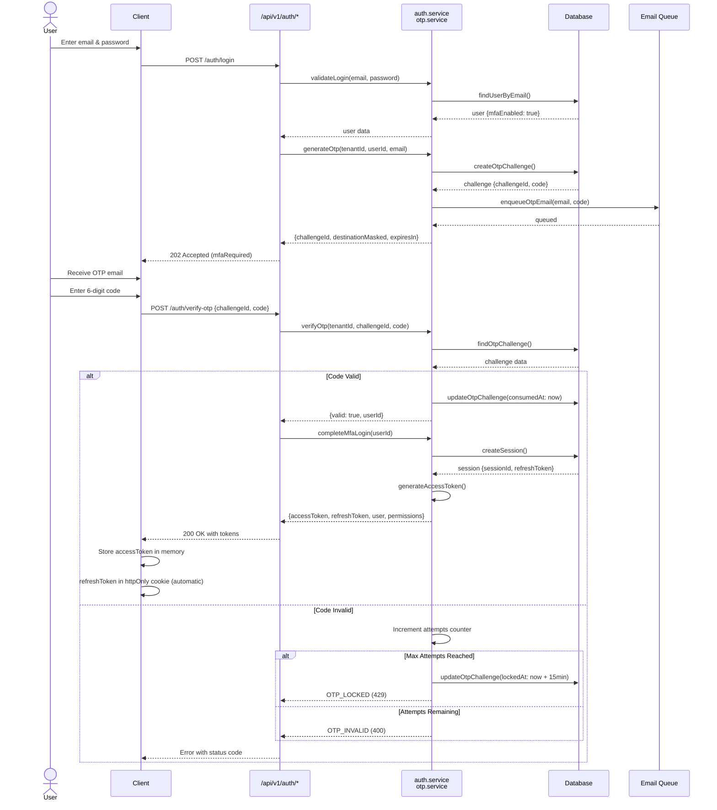
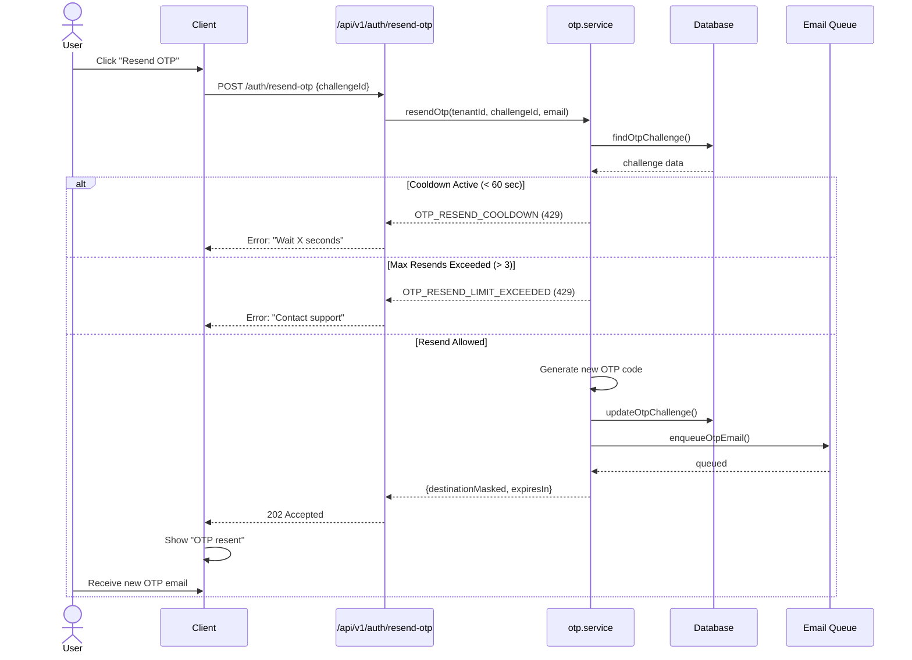
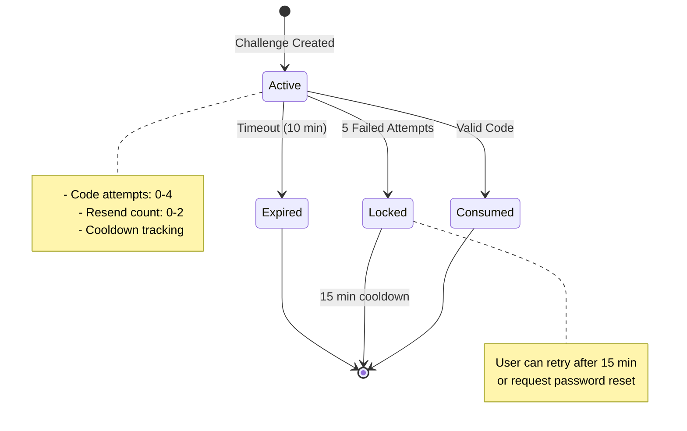
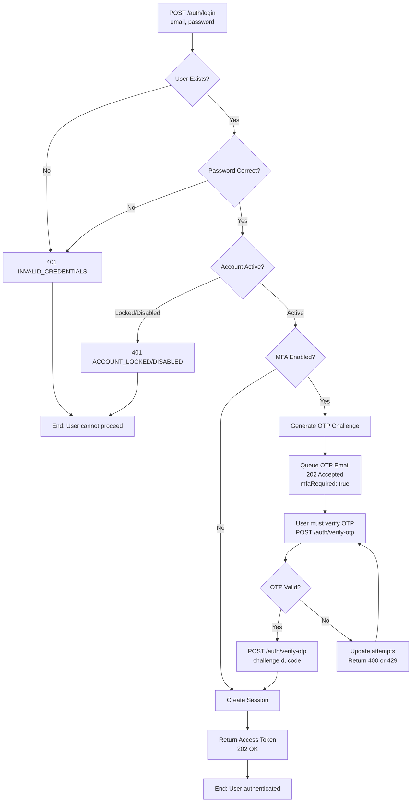

# OTP MFA Flow Diagram

## Complete MFA Login Sequence

## OTP Resend Flow

## State Machine: OTP Challenge Lifecycle

## Login Decision Tree

## Key Security Properties

1. **Raw tokens never stored**: Only SHA256 hashes in database
2. **Single-use**: OTP consumed immediately after verification
3. **Time-bounded**: 10-minute expiry on challenge
4. **Rate-limited**: 5 failed attempts → 15-minute lockout
5. **Cooldown protected**: 60 seconds between resends, max 3 resends
6. **No enumeration**: Forgot password always returns 202
7. **Session isolation**: Each MFA verification creates new session/token family
8. **Audit trail**: All OTP events logged for security monitoring
